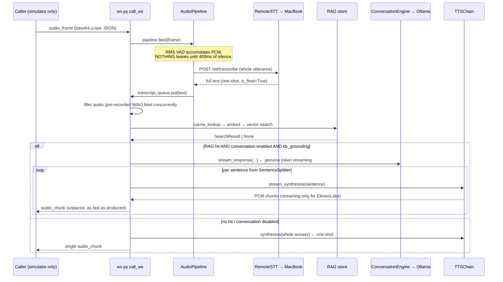
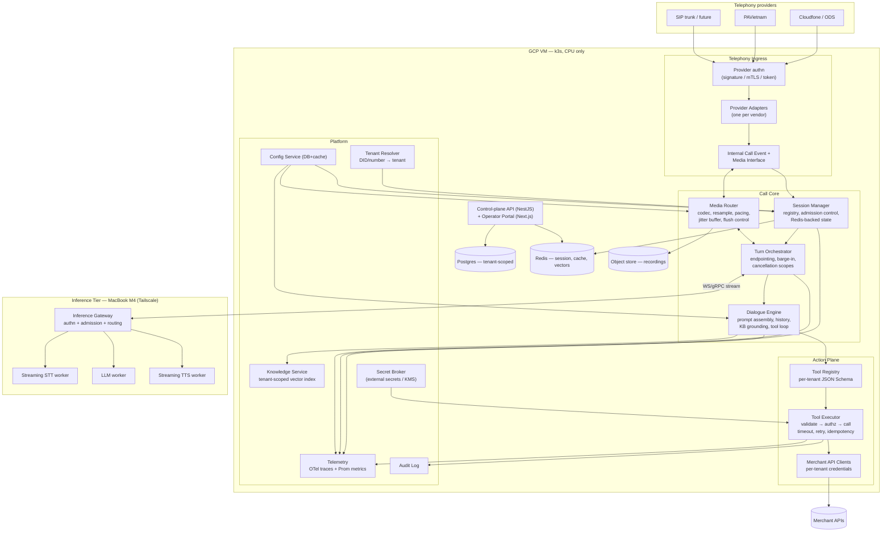
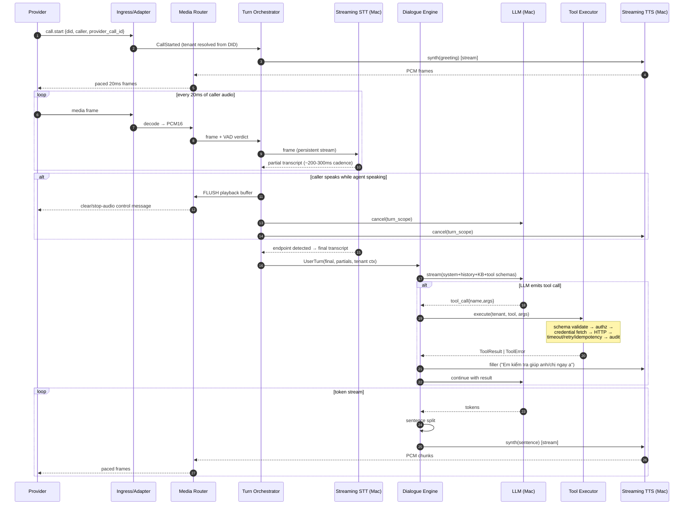
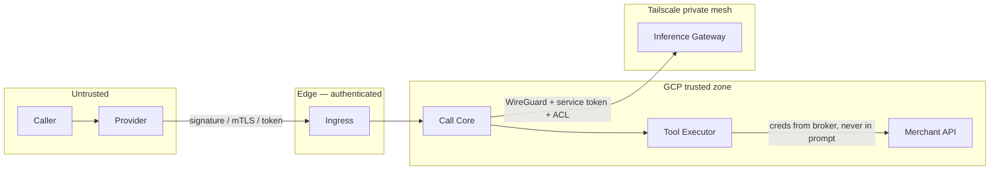

# AI Streaming Voice — Architecture & Implementation Proposal

> **Status:** Proposal / analysis only. No source code was modified to produce this document.
> **Repo analysed:** `/Users/hiendang/ai-voice` @ `57109a8` (branch `main`, working tree dirty)
> **Method:** full repo map → read of every runtime module in `services/voice/`, architectural read of `apps/api/src/` and `apps/portal/src/app/`, deploy manifests, plan XMLs, plus a live test-suite run.
> **Verification stance:** every claim below was checked against code. Where I could not verify, the item is labelled `UNKNOWN` and listed in §E, not guessed at.

---

## A. Product understanding

### A.1 What AI Streaming Voice is

AI Streaming Voice is a **multi-tenant AI voice agent platform for merchants**. Its job: when a customer phones a merchant and no human is available (nights, weekends, overflow), the platform answers the phone and holds a **real conversation** — listening, understanding, answering, and *acting* on the merchant's behalf.

The load-bearing distinctions:

| It is NOT | It IS |
|---|---|
| A chatbot with a voice bolted on | A real-time, full-duplex conversational system where latency *is* the product |
| An IVR with a hardcoded script tree | An LLM-driven agent whose behaviour is shaped by merchant config, knowledge, and tools — not by a state machine of hand-authored steps |
| A single-merchant deployment | A platform where N merchants share infrastructure with hard isolation of data, credentials, knowledge, and conversations |
| Tied to one PBX vendor | Provider-agnostic: Cloudfone / ODS / PAVietnam / future SIP trunk all enter through a Telephony Adapter and become one internal call+media interface |
| OmniSRE | An independent product. It shares a GCP VM (`omni-k3s-vm`, k3s) with Omni **as infrastructure only** — no shared domain, data model, or code |

### A.2 The pipeline that defines the product

```
caller audio ──► VAD ──► streaming STT ──► partial transcript ──► LLM (streaming)
                                                                    │
                                              ┌─────────────────────┤
                                              ▼                     ▼
                                       tool/action call        token stream
                                              │                     │
                                       merchant API                 ▼
                                              │            streaming TTS ──► audio out
                                              └─────► result ──► LLM continues
```

Everything that matters is a *streaming* property:
- **Time-to-first-audio (TTFA)** after the caller stops speaking, not total turn time.
- **Barge-in**: caller interrupts → TTS stops *and already-buffered audio is flushed at the far end* → LLM generation is cancelled → STT immediately re-opens.
- **Cancellation**: an interrupted turn must not keep burning LLM tokens or emit stale audio one second later.
- **Backpressure / pacing**: audio is a real-time medium; producing 8 seconds of PCM in 400 ms and dumping it on a socket is not "streaming", it is batch delivery with extra steps.

### A.3 Deployment shape

- **GCP VM (CPU-only, k3s)** — telephony ingress, call/session lifecycle, media transport, conversation orchestration, tool execution, merchant API integration, auth, config, persistence, observability.
- **MacBook Pro M4** — the *only* place model inference runs: streaming STT, LLM, streaming TTS. Reached over **Tailscale** as a private transport. The MacBook is a peer on a private mesh, never an Internet-exposed server, and never a trusted-by-default service (private transport ≠ authentication).
- **Consequence that is easy to under-weight:** the MacBook is a single, non-redundant, consumer machine on a home/office link. Every architectural decision must answer "what happens when it is asleep, updating, or 300 ms away?"

### A.4 Merchant API interaction is a first-class subsystem

The agent must be able to *do things* (check a booking slot, place an order, look up an order status), not just talk. The non-negotiable shape:

```
LLM → Tool Request (typed, validated) → Tool Executor → permission + schema + input validation
    → Merchant API (per-tenant credentials, timeout, retry, idempotency)
    → Result → back into the LLM context → agent continues speaking
```

The LLM never forms an HTTP request. Every call is auditable, rate-limited, tenant-scoped, and fails into a spoken fallback rather than a stack trace.

### A.5 What is unclear to me (see §E for the full table)

1. **Which telephony provider ships first, and over what media transport.** Cloudfone/ODS media schema is still unknown. Whether we get raw RTP, a WebSocket media stream, or only SIP signalling changes the entire ingress design.
2. **Concurrency target.** "How many simultaneous calls per merchant / total" is unstated and it is the single number that decides whether one M4 is a viable inference tier or a demo-only fixture.
3. **Whether the DoctorCheck clinic remains a real tenant** or is a throwaway pilot. This decides how much of the existing FSM/booking domain survives migration.
4. **Data residency / retention obligations** for Vietnamese healthcare and commerce PII (recordings, transcripts, phone numbers).
5. **Whether the MacBook is intended as production inference or as a development stand-in** for a future GPU tier. The failure model differs sharply.

### A.6 Where the stated vision collides with reality (said plainly)

- **"Real streaming" and "MacBook over Tailscale" are in tension.** Streaming STT and streaming TTS want a persistent, low-overhead, bidirectional channel to the inference host. The current design uses one-shot HTTP POSTs. Fixing this means a persistent WebSocket/gRPC session per call across Tailscale, and it means the inference host's availability becomes a per-call, per-100ms concern, not a per-request one.
- **CPU-only GCP + single M4 + multi-tenant concurrency do not obviously compose.** One M4 running Whisper-class STT + an 8B LLM + a neural TTS concurrently will saturate at a low single-digit number of concurrent calls. Either the concurrency target is small (fine — say so), or a GPU tier is on the roadmap and the architecture must not hardcode "one inference host".
- **The repo is not a multi-tenant platform today and is not one small step away.** It is a well-built single-merchant clinic IVR with a RAG layer. That is not a criticism of the code; it is a scoping fact that must drive the plan (see §F/§G).

---

## B. Current-state architecture (verified against code)

### B.1 Component map

```mermaid
graph TB
  subgraph client["Test surfaces (no real telephony)"]
    SIM["simulator/call_simulator.py<br/>WS client, mock CloudFone<br/><b>IMPLEMENTED</b>"]
    PORTALSIM["Portal /simulator page<br/><b>IMPLEMENTED</b>"]
  end

  subgraph gcp["GCP k3s — namespace ai-voice"]
    subgraph voice["services/voice (FastAPI)"]
      WS["api/routers/ws.py :: /ws/call<br/>1013 lines, all call logic<br/><b>PARTIALLY IMPLEMENTED</b>"]
      ADPT["telephony/ adapter registry<br/>1 provider, identity passthrough<br/><b>STUB</b>"]
      PROTO["cloudfone/protocol.py<br/>self-declared mock schema<br/><b>MOCK</b>"]
      ODS["cloudfone/ods_client.py<br/>returns 'pending_schema'<br/><b>STUB</b>"]
      PIPE["audio/pipeline.py<br/>buffer-until-silence<br/><b>PARTIALLY IMPLEMENTED</b>"]
      VAD["stt/vad.py — RMS energy VAD<br/><b>IMPLEMENTED (naive)</b>"]
      FSM["runtime/fsm.py + executor.py<br/>+ intent_matcher.py (457 ln regex)<br/><b>IMPLEMENTED — legacy IVR</b>"]
      CONV["llm/conversation.py<br/>streaming Ollama, DoctorCheck persona<br/><b>IMPLEMENTED</b>"]
      SPLIT["llm/sentence_splitter.py<br/><b>IMPLEMENTED</b>"]
      RAG["rag/store.py — Redis vectorset<br/>+ process-global in-memory store<br/><b>IMPLEMENTED</b>"]
      CHAIN["tts/chain.py — circuit breaker chain<br/><b>IMPLEMENTED</b>"]
      RTTS["tts/remote_tts.py / stt/remote_stt.py<br/>one-shot HTTP<br/><b>IMPLEMENTED (not streaming)</b>"]
      TOOL["Tool / Action layer<br/><b>MISSING</b>"]
      TENANT["Tenant isolation layer<br/><b>MISSING</b>"]
      OBS["Per-call tracing / metrics<br/><b>MISSING</b>"]
    end
    API["apps/api NestJS<br/>auth, RBAC, scripts CMS, KB, calls,<br/>settings, learning, audit<br/><b>IMPLEMENTED</b>"]
    PORTAL["apps/portal Next.js 15<br/><b>IMPLEMENTED</b>"]
    PG[("Postgres")]
    RD[("Redis 8 + vectorset")]
    MIN[("MinIO")]
  end

  subgraph mac["MacBook M4 — via Tailscale 100.93.3.96"]
    INF["inference_server.py :8100<br/>POST /tts/synthesize (Piper)<br/>POST /stt/transcribe (faster-whisper)<br/><b>IMPLEMENTED — no auth, no streaming</b>"]
    OLL["Ollama :11434 — qwen3:8b<br/><b>IMPLEMENTED (external)</b>"]
  end

  subgraph ext["External"]
    EL["ElevenLabs TTS/STT<br/><b>IMPLEMENTED</b>"]
    EDGE["edge-tts (MS, unofficial)<br/><b>IMPLEMENTED</b>"]
    TG["Telegram expert handoff<br/><b>IMPLEMENTED</b>"]
    MERCH["Merchant API<br/><b>MISSING (config entity only)</b>"]
  end

  SIM -->|JSON WS| WS
  PORTALSIM --> WS
  WS --> ADPT --> PROTO
  WS --> PIPE --> VAD
  PIPE --> RTTS
  WS --> FSM
  WS --> CONV --> OLL
  WS --> RAG --> RD
  WS --> CHAIN --> RTTS & EL & EDGE
  RTTS --> INF
  WS -->|webhook on hangup| API
  API --> PG & RD & MIN
  PORTAL --> API
  WS -.-> TG
  TOOL -.->|does not exist| MERCH

  style TOOL stroke-dasharray: 5 5
  style TENANT stroke-dasharray: 5 5
  style OBS stroke-dasharray: 5 5
  style MERCH stroke-dasharray: 5 5
```



### B.2 The actual turn loop, as coded



### B.3 Component-by-component verdict

| Component | File(s) | Status | Evidence |
|---|---|---|---|
| Telephony ingress (real) | — | **MISSING** | No SIP, RTP, WebRTC, Opus anywhere (`grep` over `services/voice`: zero hits). Only a JSON WebSocket the simulator speaks. |
| CloudFone/ODS protocol | `cloudfone/protocol.py` | **MOCK** | Module docstring: *"Actual ODS schema is pending — this mirrors the expected protocol"*. `ods_client.py::get_status()` literally returns `{"status": "pending_schema"}`. |
| Telephony abstraction | `telephony/{base,registry,cloudfone}.py` | **STUB** | `TelephonyAdapter` Protocol is well-shaped (3 methods, per-connection instance). But `registry.get_adapter` has exactly one branch, `CloudFoneAdapter` is an identity passthrough, and **the "internal" event shape *is* the CloudFone mock shape** — the abstraction has no second implementation to keep it honest. Docstrings still reference a removed Twilio adapter. |
| Audio ingest / VAD | `audio/pipeline.py`, `stt/vad.py` | **PARTIALLY IMPLEMENTED** | Works, but is *buffer-then-transcribe*: `_flush_buffer()` joins the whole utterance and calls STT once. VAD is bare RMS energy (`rms > 0.01`) — no silero, no noise floor adaptation, no speech/non-speech model. Fixed 400 ms end-of-utterance. |
| Streaming STT | `stt/remote_stt.py`, `inference_server.py` | **MISSING** (as *streaming*) | `POST /stt/transcribe` takes a complete PCM body and returns final text. `STTResult.is_final` exists but is always `True`. **No partial transcripts exist anywhere in the system.** |
| STT engines | `faster_whisper_stt.py`, `sensevoice_stt.py`, `elevenlabs_stt.py` | **IMPLEMENTED** | All one-shot. `SenseVoiceSTT` passes `language="vi"` — SenseVoice's officially supported set is zh/yue/en/ja/ko; Vietnamese quality here is **UNKNOWN and probably poor** (§D2). |
| LLM streaming | `llm/conversation.py` | **IMPLEMENTED** | Real SSE token streaming against an OpenAI-compatible endpoint. Correct. |
| LLM cancellation | `ws.py::_tts_stream` | **PARTIALLY IMPLEMENTED** | On interrupt it `break`s out of `async for token in sentence_gen` but never `aclose()`s the generator, so the upstream httpx stream is closed only on GC. No cancellation token, no explicit abort. |
| Sentence splitting | `llm/sentence_splitter.py` | **IMPLEMENTED** | Vietnamese-aware (`ạ,` / `nhé,` / `nha,` clause boundaries), min-chars gate, forced split at word boundary. Genuinely good. |
| Streaming TTS | `tts/chain.py` + engines | **PARTIALLY IMPLEMENTED** | Sentence-level pipelining is real. But per engine: **ElevenLabs = true streaming**; **edge-tts = synthesizes the whole utterance and yields ONE chunk**; **RemoteTTS (Piper on MacBook) = full synthesis then slice into 1 KB chunks** — its own docstring says *"pseudo-stream"*; **PiperTTS local = same**. So under the currently deployed config (`TTS_ENGINE: remote`) **there is no streaming TTS in production, only chunked batch delivery.** |
| Audio egress pacing | `ws.py::_send_audio` | **MISSING** | Chunks are `ws.send_json`'d as fast as the generator yields. No 20 ms pacing, no sequence numbers, no timestamps, no jitter buffer, no backpressure signal. |
| Barge-in | `ws.py` + `stt/vad.py` | **PARTIALLY IMPLEMENTED / BROKEN in principle** | Sets an `asyncio.Event`; a 300 ms half-duplex window suppresses TTS echo. But: (a) **no "stop/flush playback" event is ever sent to the telephony side**, so audio already handed to the provider still plays — the caller keeps hearing the agent after interrupting; (b) barge-in is detected only on `audio_frame` arrival inside the main loop; (c) `barge_in_count` is incremented per *frame*, so one interruption inflates the metric by dozens. |
| Conversation architecture | `runtime/*` **and** `llm/conversation.py` | **DUPLICATE** | Three coexisting paths: (1) FSM script IVR, (2) `rag_assisted` RAG+LLM, (3) `_fsm_rag_intercept` — a hardcoded Vietnamese question regex that lets RAG answer mid-FSM. Mode chosen by `script.execution_mode`. |
| Tool / Action layer | — | **MISSING** | Zero hits for `tool_call`, `function_call`, `tools=`, `tool_choice` across the whole repo. The LLM cannot take any action. |
| Merchant API integration | `settings/doctorcheck-settings.entity.ts` | **MISSING** | The entity holds `baseUrl`, `apiKey`, `specialtyMapping`, `slotMapping`, `bookingConfirmTemplate`, `retryCount`, `timeoutMs` — and the only code that touches `baseUrl` is a `GET /health` connectivity probe in `settings.service.ts`. **No booking is ever placed.** |
| Multi-tenancy | — | **MISSING** | All settings tables are single-row (`@PrimaryColumn({default:'default'})`). `grep -i tenant` over `apps/api/src` returns one seed string and the ODS stub. `rag/store.py` keeps `_store` / `_article_map` as **module-level globals** — a process-wide shared knowledge base. `nlu/store.py` likewise. Persona and fallback strings are hardcoded DoctorCheck Vietnamese in `llm/conversation.py::_BASE_SYSTEM`, `rag/store.py::FALLBACK_MALE/FEMALE`, and `ws.py::_question_timeout`. |
| Session state | `runtime/session.py` | **PARTIALLY IMPLEMENTED** | Nicely immutable (`frozen=True`, `with_*` helpers). But it lives **only in the WS coroutine's local variable**. Nothing in Redis. Pod restart or WS drop = state gone, no recovery. |
| Call persistence | `ws.py::_post_call_events` → `internal.controller.ts` | **IMPLEMENTED** | Fired in the `finally` block. Best-effort with a 5 s timeout; on failure the call record is silently lost (`logger.warning` only). |
| Auth on the call path | `ws.py` | **MISSING** | `/ws/call` accepts any connection. No token, no signature, no provider verification, no tenant claim. |
| Inference server security | `inference_server.py` | **MISSING** | Binds `0.0.0.0:8100`, no API key, no rate limit, no request size cap, no concurrency control. Tailscale is the *only* control. Singleton models behind `lru_cache` — concurrent calls serialize on one `WhisperModel` and one Piper voice through the default thread pool. |
| Config plane | `api/remote_config.py` + NestJS settings | **IMPLEMENTED, with a trap** | Config is fetched from NestJS (DB) and cached in Redis; env vars are **only** the unreachable-API fallback. So `deploy/k8s/config/configmap.yaml` declaring `STT_ENGINE: remote` / `TTS_ENGINE: remote` **does not guarantee** the cluster uses the MacBook — the DB row wins. The deployed engine is effectively **UNKNOWN without inspecting the live DB.** |
| Observability | `metrics/elevenlabs.py`, `logger.info("TTFA…")` | **MISSING** | One Redis hash of ElevenLabs counters, plus TTFA log lines. No Prometheus, no OpenTelemetry, no trace/correlation id, no per-stage latency record. Zero hits for `prometheus|opentelemetry|trace_id`. **The system cannot answer "where did the 2 seconds go".** |
| Tests | `services/voice/tests/` | **PARTIALLY IMPLEMENTED** | Verified run: **292 passed in 1.88 s**. That runtime is the finding — everything is mocked. No realtime audio test, no barge-in timing test, no protocol conformance test, no load/concurrency test, no failure-injection test. Coverage gate 80% with the hard modules explicitly `omit`ted. |

### B.4 Concrete defects found while reading (not fixed, per instruction)

| # | Severity | Location | Defect |
|---|---|---|---|
| D1 | **CRITICAL** | `ws.py::turn_handler` | The `while not call_ended.is_set()` loop has **no exception guard** around `process_utterance`. Any exception (RAG error path, TTS chain exhaustion, Redis blip) kills the task permanently. The WebSocket stays open, audio keeps arriving, and **the agent goes permanently deaf mid-call with no error surfaced to the caller.** |
| D2 | **CRITICAL** | `audio/pipeline.py::_flush_buffer` → `ws.py::_drain_pipeline` | `RemoteSTT.transcribe_pcm` raises `RemoteSTTError` when the MacBook is unreachable. Nothing catches it. The exception propagates out of the `process()` async generator, kills `pipeline_task`, and is never retrieved. **MacBook offline ⇒ silent zombie call.** This is the single most likely production failure and it currently has no handling. |
| D3 | HIGH | `ws.py` barge-in | No flush/stop signal is sent downstream, so the caller keeps hearing already-delivered audio after interrupting. Barge-in is only half-implemented by construction. |
| D4 | HIGH | `inference_server.py` | No authentication on `/tts/synthesize` and `/stt/transcribe`. Anything on the tailnet — including any other machine or service sharing that Tailscale account — can drive the inference tier. |
| D5 | HIGH | repo root | `elevent_key` is an untracked file containing an ElevenLabs API key and **is not in `.gitignore`** (verified: `git check-ignore` exits 1). One `git add .` from being committed. Treat the key as compromised and rotate. |
| D6 | MEDIUM | `ws.py::_post_call_events` | `datetime.fromtimestamp(started_at).isoformat()` and `datetime.now().isoformat()` are naive local time, while the rest of the system uses UTC / `+07:00`. Call timestamps will be inconsistent. |
| D7 | MEDIUM | `ws.py` barge-in counter | Incremented per audio frame while speech is active, not per interruption event. `bargeInCount` in `call_metrics` is inflated by roughly the frame rate and is not usable as a KPI. |
| D8 | MEDIUM | `tts/chain.py::CircuitBreaker` | In-memory, per-process, and the chain is rebuilt **per WebSocket connection** — so breaker state resets on every new call and never accumulates. `refactor_plan.xml` explicitly specified Redis-backed shared state; that was not done. Effectively the circuit breaker only protects within a single call. |
| D9 | MEDIUM | `tts/chain.py::stream_synthesize` | When every engine fails it returns an **empty generator** and logs an error. The caller emits no audio and no fallback speech — the caller hears silence with no indication anything went wrong. |
| D10 | MEDIUM | `ws.py` START handler | `interception_mode` and `interception_domains` are re-declared with `:` type annotations inside the handler, shadowing the enclosing-scope variables. They are then read from `_rag_turn`/`_fsm_rag_intercept` via closure. This works only because they are also assigned at function top level; it is fragile and one refactor away from an `UnboundLocalError`. |
| D11 | LOW | `ws.py` | Unused imports carried from deleted paths (`OutboundEvent`, `ElevenLabsTTS`, `GwenTTS`, `build_tts_chain` imported twice, `TranscriptEntry`). Docstrings still describe Twilio behaviour that no longer exists. |
| D12 | LOW | `ws.py` (1013 lines) | The entire call runtime — protocol handling, VAD wiring, RAG, FSM, LLM, TTS, Telegram escalation, persistence — lives in one function-scope closure in one file. Violates the repo's own 800-line rule and makes any of the above impossible to unit-test in isolation. |

---

## C. Target architecture

### C.1 Principles

1. **The call is a pipeline of independent streams, not a request/response loop.** Ingest, STT, dialogue, TTS, and egress each run as a task with its own lifecycle and its own cancellation.
2. **One internal call+media contract.** Providers translate into it; nothing downstream ever learns a provider's name.
3. **The inference tier is remote, streaming, authenticated, and replaceable.** GCP holds no model weights; the MacBook holds no orchestration logic; either can be swapped.
4. **Tenant is a first-class parameter on every path** — session, config, knowledge, prompt, tool, credential, log, metric.
5. **The LLM proposes; the Tool Executor disposes.** No model-formed HTTP requests, ever.
6. **Every call emits a trace.** If a latency number cannot be attributed to a stage, the stage is not instrumented.

### C.2 Target component architecture



### C.3 Audio & control flow, end to end



### C.4 Internal contracts (the pieces that must be nailed down first)

**Call control events (provider-agnostic, versioned):**
`call.started` · `call.media` · `call.dtmf` · `call.ended` · `call.error`
outbound: `agent.media` · `agent.flush` · `agent.transfer` · `agent.hangup` · `agent.mark`

`agent.flush` is the piece that does not exist today and without which barge-in cannot work.

**Media frame:** `{call_id, seq, ts_ms, codec, payload}` — sequence and timestamp are mandatory; a receiver that cannot detect gaps cannot implement a jitter buffer.

**Inference session protocol (GCP ⇄ MacBook), one persistent connection per call:**
- `stt.open{call_id, tenant, sr, lang}` → `stt.audio` (binary) → `stt.partial{text,stability}` / `stt.final{text,conf,words}` / `stt.endpoint`
- `llm.generate{turn_id, messages, tools}` → `llm.delta` / `llm.tool_call` / `llm.done`; `llm.cancel{turn_id}`
- `tts.synth{turn_id, text, voice, params}` → `tts.audio` (binary) / `tts.done`; `tts.cancel{turn_id}`
- Every frame carries `turn_id` so cancellation is exact and late frames from a cancelled turn are dropped by id, not by timing luck.

**Tool contract:**
```
ToolDefinition  { tenant_id, name, description, input_schema (JSON Schema),
                  endpoint, auth_ref, timeout_ms, retry_policy, idempotent,
                  rate_limit, pii_fields, requires_confirmation }
ToolInvocation  { call_id, turn_id, tenant_id, tool, args, idempotency_key }
ToolResult      { status: ok|invalid|denied|timeout|upstream_error|rate_limited,
                  data | error_code, latency_ms, upstream_status }
```
`requires_confirmation` matters for voice: an agent should read back an order/booking before committing it.

### C.5 State management

| State | Home | Lifetime |
|---|---|---|
| Media buffers, VAD, current turn | in-process (call task) | the turn |
| Session state (history, slots, tool results, tenant ctx) | **Redis, keyed `session:{call_id}`, written per turn** | call + short TTL for recovery |
| Session registry / concurrency counters | Redis (`sessions:active`, per-tenant counters) | live |
| Tenant config, tools, prompts, KB | Postgres, cached in Redis, invalidated on write | durable |
| Transcripts, metrics, audit, recordings | Postgres + object store | durable, retention-policied |
| Secrets | external secret store, fetched at use, never logged | — |

### C.6 Failure model (each row is a required, testable behaviour)

| Failure | Detection | Required behaviour |
|---|---|---|
| MacBook offline / Tailscale down | inference session connect fail or heartbeat miss | Do not accept new calls for the affected tier (admission control). Live calls: speak a cached fallback line and transfer to voicemail/human. **Never a silent zombie call (fixes D2).** |
| STT stream stalls | no partial for N ms while speech active | Re-open stream once; on second failure, degrade to one-shot STT; if that fails, apologise + transfer |
| LLM timeout / no first token in N ms | per-turn timer | Speak a holding phrase, retry once with reduced context, then fall back to a scripted answer or transfer |
| TTS all engines fail | chain exhausted | Play a **pre-rendered** fallback WAV (already exists as filler audio) — never silence (fixes D9) |
| Merchant API timeout / 5xx | per-tool timeout | ToolResult `timeout`/`upstream_error` → the LLM is told, in-language, that the system is unavailable and offers a callback. No stack traces reach the caller |
| Merchant API returns garbage | output schema validation | Treat as `invalid`; never feed unvalidated upstream data into the prompt |
| Caller hangs up | provider event or media stop | Cancel every task in the call scope within ~100 ms; persist the call record |
| Caller interrupts | VAD during playback | Flush far-end audio, cancel LLM+TTS by `turn_id`, re-open STT |
| GCP pod restart | k8s | In-flight calls are lost (accepted); new calls served after readiness. Session state in Redis allows post-mortem, not resumption |
| Provider WS disconnects mid-call | socket close | Persist partial call record, mark `status=dropped`, emit alert metric |
| Overload | active-session counter vs limit | Reject at admission with a busy tone / "please call back" — never accept a call we cannot serve |

### C.7 Security & tenant boundary



Non-negotiables:
- Provider ingress is authenticated. Today `/ws/call` is open to anyone who can reach it.
- The inference tier requires a service token **in addition to** Tailscale ACLs. Private transport is not authentication (fixes D4).
- Merchant credentials live in a secret broker, are fetched per invocation, are never placed in an LLM prompt, and are never logged.
- Every query, cache key, vector namespace, prompt, and log line carries `tenant_id`. Process-global stores (`rag/store.py`, `nlu/store.py`) must be replaced by tenant-keyed structures — this is a *correctness* requirement, not hygiene.
- PII: phone numbers masked in logs and audit; recordings and transcripts encrypted at rest with an explicit retention policy; a per-tenant switch for whether recording happens at all.

---

## D. Critical technical decisions

Format per decision: **Decision / Options / Recommendation / Reason / Trade-offs / Must be benchmarked or verified.**

---

### D1. Telephony ingress: SIP/RTP vs provider media WebSocket

- **Options:** (a) provider-hosted media WebSocket (what the mock assumes); (b) own SIP+RTP stack (drachtio/FreeSWITCH/Asterisk or `aiortc`/`pjsip`); (c) SIP signalling to a media gateway that converts to WS.
- **Recommendation:** **(a) for v1, with the internal media interface designed so (b) can be added without touching the call core.** Do not build a SIP stack before a provider forces it.
- **Reason:** Vietnamese virtual-PBX vendors typically expose a WS/HTTP media bridge; owning SIP+RTP means owning NAT traversal, RTCP, DTMF (RFC2833), jitter, and codec negotiation — months of work with no product value if the provider already solves it.
- **Trade-offs:** vendor-dependent; per-vendor quirks leak into adapters; a vendor without a media API blocks us entirely.
- **Verify/benchmark:** **BLOCKING** — obtain the Cloudfone/ODS media spec: transport, framing, codec, sample rate, who paces, whether a flush/clear control message exists (barge-in is impossible without it), DTMF representation, and reconnect semantics. Everything in §G Phase 2 depends on this one document.

---

### D2. STT engine — Vietnamese capability is a hard gate

- **Options:** faster-whisper `small`/`medium` (current), **PhoWhisper (VinAI, Vietnamese-finetuned Whisper)** via CTranslate2, MLX-Whisper (Apple-Silicon-native), SenseVoiceSmall (in repo), ElevenLabs Scribe (cloud), wav2vec2-based Vietnamese ASR, WhisperLive/whisper-streaming wrappers for true partials.
- **Recommendation:** **PhoWhisper-small or -medium converted to CTranslate2, served by faster-whisper with a streaming/chunked decoder, on the M4.** Keep ElevenLabs Scribe as a cloud fallback for overload/outage. **Drop SenseVoice for Vietnamese** unless benchmarking contradicts me.
- **Reason:** generic Whisper degrades noticeably on Vietnamese telephone-band audio (8 kHz, μ-law, noisy); PhoWhisper is finetuned on Vietnamese speech including varied accents (Bắc/Trung/Nam), which is exactly the failure mode that kills a phone agent. On SenseVoice: the code calls it with `language="vi"`, but SenseVoice's officially supported languages are zh/yue/en/ja/ko — Vietnamese is at best incidental. It was adopted for its emotion tags (`implement_sensevoice.xml`), which is the wrong reason to pick an ASR.
- **Trade-offs:** PhoWhisper needs a CT2 conversion step and is heavier than `small`; MLX-Whisper is faster on Apple Silicon but has a weaker streaming story; true partial transcripts require a chunked decoder with context carry-over, which adds complexity and a small accuracy cost vs. one-shot.
- **Verify/benchmark:** build a **Vietnamese telephony test set** (≥200 utterances, 8 kHz μ-law, three regional accents, background noise, plus the domain vocabulary: names, addresses, dates, phone numbers, product/service terms). Measure **WER + time-to-first-partial + time-to-final + RTF** for: faster-whisper small/medium, PhoWhisper small/medium, MLX-Whisper, SenseVoice, ElevenLabs Scribe. Also measure whether upsampling 8 k→16 k with a decent filter beats feeding 8 k directly.

---

### D3. TTS engine — **Vietnamese depth is a hard requirement, not "multilingual support"**

This is the decision I would spend the most time on, because it is the one the caller judges in the first two seconds.

**What "deep Vietnamese support" must mean here — the acceptance rubric:**
1. **Tones** — all six (ngang, huyền, sắc, hỏi, ngã, nặng) rendered distinctly; `hỏi` vs `ngã` is where weak models collapse and where meaning is lost.
2. **Phonology** — final consonants (`-c/-ch`, `-t/-nh`, `-p`), diphthongs (`uô`, `ươ`, `iê`), and regional realisation consistent within one voice.
3. **Numbers/dates/currency** read as Vietnamese speech, including the irregulars: `mốt`/`lăm`/`lẻ`, `nghìn`/`ngàn`, `giờ`/`phút`, `ngày … tháng …`.
4. **Proper nouns and loanwords** — Vietnamese personal/place names, plus embedded English (brand names, "check-in", "combo") without collapsing into gibberish.
5. **Prosody** — question intonation, polite-particle handling (`ạ`, `nhé`, `dạ`), natural phrase breaks at commas — the difference between "a machine" and "a receptionist".
6. **Streaming** — first audio byte in tens of milliseconds, not after the whole sentence.

**Candidates, assessed against what is actually in this repo:**

| Engine | In repo | Vietnamese depth | Streaming | Verdict |
|---|---|---|---|---|
| **Piper `vi_VN-vais1000-medium`** | ✅ `models/piper/` (63 MB), `tts/piper_tts.py` | Natively Vietnamese (VAIS-1000 corpus, single female speaker). Tones are correct; **prosody is flat and clipped**, expressiveness is low, and it mangles English loanwords. `medium` quality tier — intelligible, clearly synthetic. | Not really — full synthesis then chunking. Very fast though (~30–60 ms warm). | **Keep as the latency floor and the always-available offline fallback.** Not good enough to be the primary voice of a commercial agent. |
| **edge-tts `vi-VN-HoaiMyNeural` / `NamMinhNeural`** | ✅ `tts/edge_tts.py` | **Best Vietnamese prosody of everything currently in the repo.** Microsoft's Vietnamese neural voices handle tones, numbers, and question intonation well. | ❌ as implemented: whole utterance → MP3 → ffmpeg → one chunk. Measured ~720 ms TTFA in prior work. | **Best current quality, unacceptable as a production dependency**: it is an *unofficial* use of a Microsoft endpoint — no SLA, no contract, subject to being cut off, and it forces Internet egress from GCP for every sentence. Use for demos/fallback; do not build the product on it. If Microsoft-quality Vietnamese is wanted, buy **Azure Speech** properly, which also gives real streaming and SSML. |
| **ElevenLabs (`eleven_v3` configured; flash/turbo v2.5 available)** | ✅ `tts/elevenlabs_tts.py` | Multilingual, *not* a Vietnamese specialist. Acceptable on plain sentences; **unreliable on Vietnamese proper nouns, numerals, and tone-minimal pairs**, and diction drifts on long utterances. | ✅ genuinely streaming — the only true streaming engine in the repo. | **Premium/optional voice, not the default.** Also note a live misconfiguration: `eleven_v3` is a *quality* model, not a latency model — `flash_v2_5` is the right choice for telephony (~half the TTFA). And it is per-character metered from a Vietnam-distant region. |
| **Azure Speech (official)** | ❌ | Same voices as edge-tts, contractually. Strong Vietnamese, SSML control. | ✅ real streaming | **Strong candidate for the "premium cloud" slot** if a cloud dependency is acceptable. |
| **viXTTS / XTTS-v2 Vietnamese finetune** | ❌ | Community Vietnamese finetunes; expressive, voice-cloneable. | Chunk-streaming possible | Evaluate — best quality-per-effort for a *self-hosted* expressive Vietnamese voice. Licensing (Coqui CPML) must be checked before commercial use. |
| **F5-TTS / VietTTS Vietnamese finetunes** | ❌ | Actively developed Vietnamese TTS with good tone fidelity and natural prosody. | Chunked | Evaluate as the leading self-hosted candidate on M4. |
| **Kokoro** | ❌ | **No Vietnamese.** | — | **Exclude.** Named only to close it off — it is fast and popular but does not serve this language. |
| **GwenTTS / qwen-tts** (`tts/synthesis.py`, `qwen-tts` extra) | ✅ referenced | Availability and Vietnamese quality **UNVERIFIED**; not exercised by any passing test. | — | Treat as dead code until someone proves it loads and speaks acceptable Vietnamese. |

- **Recommendation:** run a **Vietnamese TTS bake-off** (Piper vi_VN, edge-tts/Azure vi-VN, ElevenLabs flash_v2.5, viXTTS-vi, F5-TTS-vi) scored on the six-point rubric above by **native Vietnamese listeners** (MOS + a targeted error count), plus TTFA/RTF on the M4. Pending that: **primary = the best-scoring self-hosted Vietnamese model on M4 (my prior: F5/viXTTS class); floor/fallback = Piper vi_VN; premium/optional per-tenant = Azure or ElevenLabs flash.** Keep the existing `TTSChain` fallback structure — that part of the design is right.
- **Reason:** an agent that mispronounces a customer's name or reads `15/11` wrongly loses the call regardless of how fast it is. Vietnamese specialisation beats general multilingual capability at every quality tier.
- **Trade-offs:** self-hosted expressive models are 10–50× slower than Piper and need careful M4 memory budgeting alongside the LLM and STT; cloud engines add per-call cost, egress, and an outage surface; licences differ sharply.
- **Verify/benchmark (mandatory):** the **Vietnamese TTS test script** — 100 utterances covering all six tones in minimal pairs, prices (`1.250.000 đồng`), dates (`thứ Ba ngày 15 tháng 11`), times (`9 giờ 15`), phone numbers, Vietnamese personal and street names, embedded English terms, questions, and polite particles. Score MOS 1–5 by ≥3 native listeners plus a hard count of mispronunciations. Measure TTFA, RTF, memory, and concurrent-stream degradation on the M4. **Also verify the existing `tts/text_normalizer.py` against this script** — it already implements Vietnamese number-to-words including `mốt`/`lăm`/`lẻ`, which is good work worth keeping and extending, because a normalizer is required no matter which engine wins.

---

### D4. LLM runtime and model

- **Options:** Ollama (current, `qwen3:8b`), MLX-LM (Apple-Silicon-native), llama.cpp server, vLLM on a future GPU, cloud API (Claude/GPT) as fallback.
- **Recommendation:** **Keep an OpenAI-compatible interface (already done in `llm/client.py` and `conversation.py` — this is the right abstraction), benchmark MLX-LM against Ollama on the M4, and choose a 7–9B Vietnamese-capable instruct model with reliable tool-calling.** Add a cloud LLM as a configurable per-tenant fallback.
- **Reason:** the interface, not the runtime, is the architectural commitment — and the repo already got that right. MLX-LM typically wins TTFT on Apple Silicon; Ollama wins on operational simplicity. `qwen3:8b` is a *reasoning* model whose thinking traces are a latency hazard in a voice loop unless explicitly disabled.
- **Trade-offs:** MLX-LM has a thinner server/tooling story; larger models improve Vietnamese fluency but blow the TTFT budget; running LLM+STT+TTS concurrently on one M4 causes mutual slowdown that single-model benchmarks will not show.
- **Verify/benchmark:** **TTFT and tokens/sec under realistic concurrency (LLM + STT + TTS all active)**, not in isolation. Verify tool-call reliability in Vietnamese conversation (malformed-JSON rate over ≥200 turns). Verify `qwen3` thinking mode is off or budgeted. Measure quality of Vietnamese generation with tool schemas present in context.

---

### D5. GCP ⇄ MacBook transport: HTTP one-shot vs WebSocket vs gRPC

- **Options:** current one-shot HTTP; WebSocket with a binary framing; gRPC bidirectional streaming.
- **Recommendation:** **WebSocket, one persistent multiplexed session per call, binary audio frames + JSON control frames, with `turn_id` on everything.**
- **Reason:** streaming STT and cancellable TTS both require a long-lived bidirectional channel; the current one-shot POST design *structurally cannot* deliver partial transcripts or mid-utterance cancellation. WebSocket over gRPC: FastAPI already speaks it, debugging is far easier, and gRPC's advantages (codegen, flow control) do not outweigh the added toolchain here.
- **Trade-offs:** we hand-roll framing, reconnection, and heartbeats that gRPC gives free; no built-in backpressure.
- **Verify/benchmark:** **Tailscale RTT and jitter, GCP ↔ MacBook, measured over 24 h** — this is a home/office link and it is on the critical path of every turn. Also measure throughput for continuous 8 kHz PCM upstream plus TTS audio downstream per call, ×N concurrent calls, and behaviour on a forced Tailscale reconnect.

---

### D6. Audio codec, sample rate, and the resampling chain

- **Options:** keep 8 kHz μ-law end-to-end; 8 kHz μ-law at the edge with 16 kHz internal; Opus 16 kHz where a provider supports it.
- **Recommendation:** **μ-law 8 kHz at the provider edge; decode once to PCM16; run STT at the model's native rate (16 kHz) with one high-quality upsample; run TTS at native rate and downsample once to 8 kHz at the egress edge.**
- **Reason:** telephony gives 8 kHz and that ceiling is fixed. The avoidable damage is *repeated* resampling. Today: Piper synthesises 22 050 Hz → `resample_poly` to 8 kHz → **and `_resample()` peak-normalises every chunk independently**, which will cause audible level pumping across sentences. SenseVoice upsamples 8 k→16 k with `resample_poly(up=2)` with no anti-alias care.
- **Trade-offs:** a 16 kHz internal path costs CPU and memory on the M4; Opus needs provider support.
- **Verify/benchmark:** A/B STT WER on 8 kHz direct vs. upsampled-to-16 kHz. Measure the resampling and μ-law codec cost per frame. Listen for the level-pumping artefact from per-chunk normalisation.

---

### D7. Endpointing and barge-in mechanism

- **Options:** current RMS energy VAD + fixed 400 ms silence; Silero VAD (neural); STT-model-native endpointing; hybrid VAD + semantic endpointing.
- **Recommendation:** **Silero VAD for speech/non-speech + adaptive silence threshold (short after a question, longer after an open prompt), plus STT-native endpoint hints. Barge-in = VAD speech during playback → immediately: `agent.flush` downstream, `llm.cancel(turn_id)`, `tts.cancel(turn_id)`, STT re-open.**
- **Reason:** RMS energy cannot distinguish speech from line noise, TV in the background, or a cough — the two failure modes it produces (cutting the caller off, or waiting through noise) are both call-killers. And the flush signal is the piece that makes barge-in *perceptible* to the caller rather than merely internal.
- **Trade-offs:** Silero adds a torch/ONNX dependency and ~1 ms/frame; adaptive thresholds add tuning surface; aggressive barge-in causes false triggers on echo (the existing 300 ms half-duplex window is a reasonable mitigation and should be kept).
- **Verify/benchmark:** false-trigger and missed-endpoint rates on real noisy Vietnamese phone recordings. **Barge-in reaction time measured end-to-end at the caller's ear**, not at the server — the only number that matters. Verify whether the chosen provider supports a flush/clear control message (**BLOCKING** — see D1).

---

### D8. Dialogue architecture: keep the FSM, or go LLM-first?

- **Options:** (a) keep FSM as primary with RAG interception (current default); (b) LLM-first with tools and knowledge, no FSM; (c) LLM-first with an optional per-tenant guardrail policy for regulated flows.
- **Recommendation:** **(c).** LLM-first is the product. Retain a small declarative *policy* layer (required-fields checklists, confirmation-before-commit, escalation triggers) — but delete the 457-line regex intent matcher, the condition-expression FSM, and the `_fsm_rag_intercept` hybrid.
- **Reason:** the FSM path *is* the IVR the product exists to replace. Three coexisting dialogue paths triple the test matrix and make behaviour unpredictable. What is worth keeping from that subsystem: the sentence splitter, the text normalizer, the pre-rendered fillers, and the immutable session-state design.
- **Trade-offs:** losing determinism where a merchant needs a fixed script; LLM-first needs stronger guardrails and evaluation; the migration invalidates the Script CMS UI in the Portal.
- **Verify/benchmark:** does a tool-calling LLM reliably collect required fields (name, phone, date/time) in Vietnamese over ≥100 simulated calls without a state machine? Measure completion rate and hallucination rate against the current FSM baseline.

---

### D9. Tool-calling protocol

- **Options:** OpenAI-style function calling; a constrained-decoding JSON grammar; a bespoke text protocol.
- **Recommendation:** **OpenAI-style tool calling with per-tenant JSON Schema definitions, executed exclusively by a server-side Tool Executor.** Add constrained/grammar decoding only if malformed-call rate proves unacceptable.
- **Reason:** it is the format the models are trained on and the interface `llm/client.py` already speaks. Every guarantee the product needs — authz, validation, timeout, idempotency, audit, tenant scoping — belongs on the server side of that boundary, never in the prompt.
- **Trade-offs:** smaller local models are less reliable at tool calls than frontier models; JSON adds latency to the turn; a mid-turn tool call needs a spoken filler or the caller hears dead air.
- **Verify/benchmark:** malformed-tool-call rate for the chosen local model over ≥200 Vietnamese turns; end-to-end added latency of a tool round-trip; whether a filler adequately covers a 1–2 s merchant API call.

---

### D10. Merchant API contract

- **Options:** each merchant implements our spec; we write a per-merchant adapter; a hybrid (spec-first with adapters for legacy).
- **Recommendation:** **Publish a small versioned "Merchant Integration Spec" (availability, create-booking/order, lookup, cancel) and support per-tenant adapters for merchants who cannot meet it.** Declare every tool with an explicit JSON Schema regardless of which side wrote it.
- **Reason:** without a published spec, onboarding cost is linear in merchants and every integration is bespoke forever.
- **Trade-offs:** a spec slows the first two integrations and speeds the next twenty.
- **Verify/benchmark:** measure real merchant API latency and error rates (**DoctorCheck's actual booking API has never been called by this system** — its latency is entirely unknown); decide the timeout budget from data, not from the current arbitrary `timeoutMs: 3000`.

---

### D11. Session state & recovery

- **Options:** in-process only (current); Redis write-through per turn; full event-sourced call log.
- **Recommendation:** **Redis write-through per turn**, with the call record persisted to Postgres at end-of-call (the existing `_post_call_events` webhook, hardened so failures are retried rather than logged and dropped).
- **Reason:** enables tenant-level concurrency accounting, live monitoring, post-mortem debugging, and warm handoff to a human. Full event sourcing is over-engineering for v1.
- **Trade-offs:** a Redis write per turn on the latency path (small — do it off the critical path); Redis becomes a dependency of call correctness.
- **Verify/benchmark:** Redis write latency at the target call rate; confirm a mid-call pod restart loses only the in-flight call and leaves a coherent record.

---

### D12. Secret management

- **Options:** current (`.env` + a k8s ExternalSecret to Vault + a stray `elevent_key` file); Vault/ExternalSecrets throughout with per-tenant paths; GCP Secret Manager.
- **Recommendation:** **All secrets in the external store with per-tenant paths; the Tool Executor fetches credentials at invocation time; nothing merchant-related is ever stored in a settings table as plaintext.** The current `doctorcheck_settings.apiKey` column is exactly the pattern to eliminate.
- **Reason:** multi-tenant merchant credentials in application tables is a breach waiting to happen — one SQL injection or one over-broad admin role exposes every merchant's API key at once.
- **Trade-offs:** a secret fetch on the tool path (cache with short TTL); operational complexity per tenant.
- **Verify/verify now:** ExternalSecrets/Vault is already wired (`deploy/k8s/config/externalsecret.yaml`) — confirm it actually resolves in the cluster. **And handle D5 immediately: `elevent_key` is untracked, un-gitignored, and holds a live ElevenLabs key — rotate it.**

---

### D13. Multi-tenancy model

- **Options:** row-level `tenant_id` on a shared schema; schema-per-tenant; database-per-tenant.
- **Recommendation:** **Row-level `tenant_id` with enforcement in a repository/guard layer (and Postgres RLS where feasible), plus per-tenant namespaces for Redis keys and vector indices.**
- **Reason:** correct trade-off at tens-to-hundreds of merchants; schema-per-tenant makes migrations painful for little gain at this scale.
- **Trade-offs:** one missed `WHERE tenant_id = ?` leaks data — which is why enforcement must be structural, not by convention.
- **Verify/benchmark:** a cross-tenant isolation test suite that asserts tenant A can never observe tenant B's knowledge, config, transcripts, or tool results — run in CI, treated as a release gate.

---

## E. Assumptions & unknowns

| # | Assumption | Confidence | How to verify | Blocking? |
|---|---|---|---|---|
| A1 | Cloudfone/ODS will expose a media stream (not signalling only) | **Low** | Obtain the ODS integration doc; run a test call | **YES — blocks all of Phase 2** |
| A2 | The provider supports a flush/clear-audio control message | **Low** | Same doc | **YES — blocks real barge-in** |
| A3 | Telephony audio is μ-law 8 kHz mono | Medium | Same doc | Yes |
| A4 | One M4 can serve the target concurrent-call count | **Low** | Load test STT+LLM+TTS concurrently | **YES — sizing decision** |
| A5 | Tailscale GCP↔MacBook latency is stable and low | **Low** | 24 h continuous RTT/jitter probe | **YES — on every turn's critical path** |
| A6 | Target concurrency is small (≤5 simultaneous calls) for v1 | Unknown | Product decision | **YES** |
| A7 | PhoWhisper-class Vietnamese ASR beats generic Whisper on 8 kHz | Medium-High | Vietnamese telephony WER benchmark (D2) | Yes |
| A8 | A self-hosted Vietnamese TTS on M4 can reach production quality | Medium | Vietnamese TTS bake-off (D3) | **YES — product-defining** |
| A9 | The deployed cluster genuinely routes STT/TTS/LLM to the MacBook | **Low** | Read the live `tts_settings`/`stt_settings` rows — **DB config overrides the ConfigMap** | Yes |
| A10 | The GCP cluster is actually running and reachable | Unknown (not verified from this machine) | `kubectl -n ai-voice get pods` | No |
| A11 | DoctorCheck's booking API exists and is documented | Unknown | Ask; the repo has never called it | Yes (for the first tool) |
| A12 | The DoctorCheck clinic is a real tenant, not a throwaway pilot | Unknown | Product decision | Yes (scoping) |
| A13 | Portal + NestJS control plane are worth keeping | High | Code read — they are solid and largely tenant-agnostic in shape | No |
| A14 | Redis 8 vectorset is available in the target cluster | Medium | `redis-cli INFO server`; `rag/redis_vector.py` requires ≥8 | No (in-memory fallback exists) |
| A15 | Ollama on the MacBook is reachable and warm | Medium | Probe `100.93.3.96:11434` | Yes |
| A16 | `qwen-tts`/GwenTTS is installable and Vietnamese-capable | **Very low** | Try to install; benchmark | No (candidate for deletion) |
| A17 | No regulatory bar to recording Vietnamese healthcare calls | Unknown | Legal review | Yes (before production) |
| A18 | Telegram expert-handoff remains a product feature | Medium | Product decision | No |
| A19 | edge-tts is acceptable as a production dependency | **Low — I recommend no** | Legal/TOS review | Yes (if it is the primary voice) |
| A20 | 292 green tests indicate a working system | **False — verified** | Suite runs in 1.88 s; every I/O path is mocked | No (informs test strategy) |

---

## F. Gap analysis — CURRENT vs TARGET

### F.1 MISSING (does not exist)

| Gap | Impact |
|---|---|
| Real telephony ingress (any provider) | **The product cannot take a phone call today.** Only the simulator can connect. |
| Streaming STT / partial transcripts | Whole-utterance latency is structural; no early endpointing, no speculative processing |
| Streaming TTS on the deployed path | `remote`/edge-tts synthesise fully before emitting; only ElevenLabs streams |
| Audio pacing, jitter buffer, sequence numbers | Real-time delivery is unmanaged |
| Playback flush / stop-audio control | Barge-in cannot be made audible to the caller |
| Turn-scoped cancellation (`turn_id`) | Interrupted turns keep generating |
| Tool / Action layer | The agent can talk but cannot do anything |
| Merchant API client (any) | Core product capability absent |
| Multi-tenancy (data, config, KB, secrets, quotas) | Cannot onboard a second merchant safely |
| Session persistence & registry | No recovery, no admission control, no live monitoring |
| Ingress authentication | Anyone reaching the pod can open a call |
| Inference-tier authentication | Anyone on the tailnet can drive the models |
| Per-call tracing & metrics | Cannot diagnose latency — the stated observability requirement is unmet |
| Concurrency limits / admission control | `maxConcurrentSessions` is parsed and never used |
| Failure handling for inference-tier outage | See D2 — becomes a silent zombie call |

### F.2 INCORRECT (exists but wrong for the target)

| Item | Why |
|---|---|
| `RemoteTTS.stream_synthesize` | Pseudo-stream: full synthesis then slicing. Presents as streaming; is not. |
| `EdgeTTS.stream_synthesize` | Yields the entire utterance as one chunk. |
| RMS-energy VAD | Cannot separate speech from noise on a phone line. |
| `CircuitBreaker` per-connection, in-memory | Resets every call; never accumulates; contradicts its own design doc. |
| `TTSChain.stream_synthesize` on total failure | Returns an empty generator → silence, no fallback speech. |
| `barge_in_count` | Counts frames, not interruptions. |
| Naive-datetime call timestamps | Inconsistent with the rest of the system. |
| Merchant API key stored plaintext in a settings table | Wrong place for a per-tenant credential. |
| `eleven_v3` configured for telephony | Quality-tier model where a latency-tier (`flash_v2_5`) is needed. |
| SenseVoice used for Vietnamese | Vietnamese is outside its supported set; chosen for emotion tags. |
| The "internal" event protocol = the CloudFone mock shape | The abstraction is defined by the thing it is meant to abstract. |

### F.3 INCOMPLETE (right direction, unfinished)

`TelephonyAdapter` (one identity adapter, no second implementation to validate it) · `AudioPipeline` (works, but batch-shaped) · barge-in (detection only, no flush, no cancel) · `SessionState` (good design, no persistence) · `_post_call_events` (fire-and-forget, drops records on failure) · RAG store (Redis vectorset done, tenant scoping absent) · config plane (works, but ConfigMap↔DB divergence is a live trap) · ElevenLabs metrics (one hash; not a metrics system).

### F.4 OVER-ENGINEERED / not needed for the target

`runtime/intent_matcher.py` (457 lines of hand-tuned Vietnamese regex — obsoleted by an LLM) · the FSM condition-expression language and its lint rules (L001–L008) · `_fsm_rag_intercept`'s hardcoded question regex · the interception modes (`shadow`/`medium`/`full` with domain-tag filtering) · gender detection via F0 autocorrelation driving pronoun choice (a nice idea with a real misclassification risk on 8 kHz audio, and a social hazard when it is wrong) · the emotion→TTS-params mapping (unmeasured benefit, non-trivial complexity).

### F.5 DUPLICATE

Three dialogue paths (FSM / rag_assisted / FSM+RAG intercept) · two TTS build paths (`main.py::_build_tts` for `app.state.tts` **and** `chain.py::build_tts_chain` per session, both live in `ws.py`) · two RAG entry points (`ws.py::_rag_turn` and `runtime/ai_executor.py`, the latter largely unused in the WS path) · three `fallback_order` defaults that disagree across `chain.py`, `remote_config.py::__post_init__`, and `remote_config.py::_parse`.

### F.6 NEEDS REFACTOR

`ws.py` (1013 lines, one closure, everything) must be decomposed into Session / Media / Turn / Dialogue / Egress modules before any of the target work is tractable · `rag/store.py` and `nlu/store.py` module-global state must become tenant-keyed instances · engine construction must move behind a factory with explicit lifecycle rather than being rebuilt per WebSocket.

### F.7 NEEDS DELETION

`cloudfone/ods_client.py` (stub; replace with the real adapter once the schema lands) · `tts/synthesis.py` / GwenTTS / the `qwen-tts` extra (unverified, untested) · `runtime/ai_executor.py` (superseded by `ws.py::_rag_turn`) · dead imports and Twilio-era docstrings in `ws.py` · `elevent_key` (**delete and rotate the key**) · the FSM stack once D8 is accepted.

---

## G. Implementation plan

Phases are derived from *this* codebase, not from a template. Phase 0 and Phase 1 are ordered so that the two things that can invalidate the whole plan — the provider media spec and the M4 inference budget — are resolved before significant code is written.

---

### Phase 0 — De-risk, decide, and stop the bleeding (1–2 weeks)

**Goal:** eliminate the blocking unknowns and the live security exposure before any architecture is committed.

**Dependencies:** access to Cloudfone/ODS documentation or a contact; MacBook available for benchmarking.

**Files/modules affected:** none functionally except security fixes; produces `docs/` benchmark reports.

**Tasks**
1. **Rotate the ElevenLabs key**; delete `elevent_key`; add a secret-scanning pre-commit hook. *(D5)*
2. Obtain the **ODS/Cloudfone media spec** (transport, framing, codec, pacing, flush support, DTMF, reconnect). Escalate as a formal blocker if unavailable. *(A1, A2, A3)*
3. **Vietnamese STT benchmark** (D2) on a 200-utterance 8 kHz telephony set: faster-whisper small/medium, PhoWhisper small/medium, MLX-Whisper, ElevenLabs Scribe, SenseVoice. Report WER + latency + RTF.
4. **Vietnamese TTS bake-off** (D3) against the six-point rubric, scored by ≥3 native listeners: Piper vi_VN, edge-tts vi-VN, ElevenLabs flash_v2_5, viXTTS-vi, F5-TTS-vi. Report MOS, mispronunciation counts, TTFA, RTF.
5. **M4 concurrency budget**: measure STT + LLM + TTS running together at 1/2/4/8 concurrent streams. Produce a hard "max concurrent calls per M4" number. *(A4, A6)*
6. **Tailscale link characterisation**: 24 h RTT/jitter/loss probe, plus reconnect behaviour. *(A5)*
7. **Verify the deployed config reality**: read the live `tts_settings`/`stt_settings` rows and confirm what the cluster actually runs. *(A9)*
8. Add **auth to `inference_server.py`** (service token + tailnet ACL) and a request-size cap. *(D4)*
9. Patch the two call-killing defects **D1** and **D2** with minimal guards — before any real traffic, not after.

**Tests:** benchmark harnesses become permanent tooling (`bench/` scripts, reproducible, checked in).

**Acceptance:** a written decision record for STT, TTS, LLM runtime, transport, and codec; a concurrency number; a provider spec or a formally escalated blocker; no live secret in the working tree; the inference server rejects unauthenticated requests.

**Risks:** the ODS spec may not arrive → mitigate by designing the adapter against a documented internal interface and building a **provider conformance simulator** so Phase 3+ is not blocked.

**Rollback:** analysis-only; the three code changes are small and independently revertible.

---

### Phase 1 — Extract the call core from `ws.py` (2–3 weeks)

**Goal:** make the runtime modifiable. Nothing in Phases 2–6 is safely achievable inside a 1013-line closure.

**Dependencies:** Phase 0 decisions.

**Files:** `services/voice/api/routers/ws.py` → new `services/voice/call/` package (`session.py`, `media.py`, `turn.py`, `dialogue.py`, `egress.py`, `events.py`); `audio/pipeline.py`; `runtime/session.py`.

**Tasks**
1. Define the **internal call event + media interface** (§C.4) as typed dataclasses in `call/events.py`, independent of CloudFone.
2. Extract `SessionManager` (registry, admission control, Redis-backed state, per-tenant counters).
3. Extract `MediaRouter` (decode, resample, **pacing**, sequence/timestamps, **flush**).
4. Extract `TurnOrchestrator` with **explicit per-turn cancellation scopes** keyed by `turn_id`.
5. Extract `DialogueEngine` (prompt assembly, history, KB grounding) — LLM path only; leave FSM in place, untouched, behind a flag.
6. Reduce `ws.py` to a thin transport shim over the adapter + core.
7. Add structured logging with `call_id` / `tenant_id` / `turn_id` on every line.

**Tests:** unit tests per extracted module; a golden end-to-end test through the simulator asserting behaviour is unchanged; explicit cancellation tests (cancel mid-LLM, mid-TTS, mid-STT).

**Acceptance:** simulator behaviour identical pre/post; no module over 400 lines; every task has an owner and a cancellation path; D1/D10/D12 resolved structurally.

**Risks:** behavioural regression in a system whose tests are all mocked → mitigate with a recorded-simulator golden-transcript test captured *before* refactoring.

**Rollback:** feature-flag the new core; keep the old handler for one release.

---

### Phase 2 — Real streaming inference (3–4 weeks)

**Goal:** genuine streaming STT and TTS with turn-scoped cancellation — the technical heart of the product.

**Dependencies:** Phase 0 engine decisions; Phase 1 core.

**Files:** `inference_server.py` → `inference/` package (gateway + STT/LLM/TTS workers); `stt/remote_stt.py`, `tts/remote_tts.py` → streaming clients; `audio/pipeline.py`; `stt/vad.py`.

**Tasks**
1. Build the **inference WebSocket gateway** (authn, admission, per-call session, `turn_id` routing).
2. Implement **streaming STT** (chunked decode with context carry-over) emitting `stt.partial` / `stt.final` / `stt.endpoint`.
3. Implement **streaming TTS** for the chosen primary engine, emitting audio as it is generated; keep Piper as the fast fallback; keep `TTSChain`'s fallback semantics but make the breaker **Redis-backed and shared**.
4. Replace RMS VAD with **Silero VAD**; add adaptive endpointing.
5. Wire **LLM cancellation** (`llm.cancel`) with real generator close, not `break`.
6. Add **audio pacing + jitter buffer** in `MediaRouter`.
7. Implement **playback flush** end to end, gated on provider support (D1/A2).

**Tests:** streaming protocol conformance; partial-transcript cadence; TTFA measurement harness; barge-in latency measured at the far end; cancellation leaves no orphaned generation; inference-tier disconnect mid-stream degrades gracefully (regression test for D2).

**Acceptance:** first partial transcript ≤ 300 ms after speech onset; TTFA ≤ 600 ms p50 after endpoint; barge-in audible stop ≤ 200 ms; killing the inference server mid-call produces a spoken fallback, never silence.

**Risks:** streaming STT accuracy drop vs one-shot → measure and set a WER budget; M4 saturation → enforce the Phase 0 concurrency cap.

**Rollback:** per-engine config flag reverting to one-shot mode.

---

### Phase 3 — Telephony ingress, for real (3–5 weeks, **gated on A1**)

**Goal:** answer an actual phone call.

**Dependencies:** provider media spec; Phase 1 interface; Phase 2 pacing/flush.

**Files:** `telephony/` (adapter per provider), `call/events.py`, ingress auth middleware.

**Tasks**
1. Implement the first real provider adapter against the delivered spec.
2. Add **ingress authentication** (signature/mTLS/token) and provider-call-id correlation.
3. Implement **tenant resolution from the dialled number (DID)**.
4. Build a **provider conformance simulator** — a second "provider" whose wire shape deliberately differs from CloudFone's, to prove the abstraction is real.
5. Handle provider-side reconnection, DTMF, and transfer-to-human.
6. Redefine the internal protocol so it is **no longer** the CloudFone shape.

**Tests:** adapter unit tests per provider; conformance suite run against both adapters; ingress auth rejection tests; a real end-to-end test call.

**Acceptance:** a real inbound call is answered, converses, and hangs up cleanly; two structurally different adapters pass the same conformance suite; unauthenticated ingress is rejected.

**Risks:** the spec arrives late or is signalling-only → contingency is a SIP media gateway (Asterisk/FreeSWITCH) in front, adding 2–4 weeks.

**Rollback:** keep the simulator path as the default; enable the provider per-tenant.

---

### Phase 4 — Tool / Action layer + merchant API (3–4 weeks)

**Goal:** the agent can *do* things, safely.

**Dependencies:** Phase 1 dialogue engine; Phase 2 LLM streaming with tool calls.

**Files:** new `tools/` package (registry, executor, clients); NestJS `tools` module (CRUD + audit); Portal tool-management UI; replaces `settings/doctorcheck-settings.entity.ts`.

**Tasks**
1. `ToolDefinition` / `ToolInvocation` / `ToolResult` model + per-tenant registry in Postgres.
2. **Tool Executor**: JSON-Schema input validation → authz → credential fetch from the secret broker → HTTP with timeout/retry/idempotency-key → output validation → audit row.
3. Per-tenant HTTP clients with circuit breaking and rate limiting.
4. Wire tool schemas into the LLM prompt; handle `tool_call` in the streaming loop with a **spoken filler** covering the round trip.
5. Implement the first real merchant tools (availability check, create booking) against DoctorCheck.
6. Failure→speech mapping so upstream errors become polite Vietnamese, never stack traces.
7. `requires_confirmation` read-back before any committing action.

**Tests:** schema-validation rejection tests; timeout/retry/idempotency tests; failure-injection (500/timeout/malformed body); cross-tenant credential isolation; audit completeness; prompt-injection resistance (a merchant API response must never be able to steer the agent).

**Acceptance:** an end-to-end voice call that creates a real booking; every invocation audited with tenant, args (PII-masked), result, latency; no credential ever appears in a prompt or log.

**Risks:** local-model tool-call reliability → measure early (D9); fall back to a cloud LLM per-tenant if needed.

**Rollback:** tools are per-tenant opt-in; disabling the registry returns the agent to talk-only.

---

### Phase 5 — Multi-tenancy (3–4 weeks)

**Goal:** onboard a second merchant without risking the first.

**Dependencies:** Phases 1–4.

**Files:** every NestJS entity + service; `rag/store.py`; `nlu/store.py`; `llm/conversation.py` (persona from config); `ws.py`/`call/*`; all Redis key construction; Portal.

**Tasks**
1. `tenants` table; `tenant_id` on every domain entity; migration for existing data.
2. Repository-level enforcement (+ Postgres RLS where feasible); tenant-scoped Redis namespaces and vector indices.
3. Replace module-global `rag`/`nlu` stores with tenant-keyed instances.
4. Move persona, greetings, and fallback strings out of Python and into per-tenant config.
5. Per-tenant quotas, concurrency limits, and TTS/LLM budgets.
6. Portal: tenant switcher; scope RBAC by tenant.
7. **Cross-tenant isolation test suite as a CI release gate.**

**Tests:** the isolation suite (knowledge, config, transcripts, credentials, tool results, cache keys, vector namespaces); migration correctness; per-tenant quota enforcement.

**Acceptance:** two tenants run concurrently with zero observable crossover; the isolation suite is green and blocks release when red.

**Risks:** a missed `tenant_id` on a query path → mitigate with structural enforcement plus a static check for raw repository access.

**Rollback:** migration is additive; single-tenant mode remains valid.

---

### Phase 6 — Observability, resilience, and production readiness (2–3 weeks, overlapping)

**Goal:** answer "why did that call take 2 seconds?" and survive the failure list in §C.6.

**Files:** new `telemetry/` module; every stage boundary; k8s manifests.

**Tasks**
1. **OpenTelemetry traces**: one span per stage (ingest → VAD → STT partial → STT final → LLM TTFT → LLM done → tool → TTS first byte → egress), correlated by `call_id`/`turn_id`.
2. **Prometheus metrics**: per-stage latency histograms, active calls, barge-in rate (**per interruption, not per frame** — fixes D7), tool success/latency, engine fallback counts, STT/TTS/LLM errors.
3. Per-call latency summary persisted with the call record.
4. Implement every failure behaviour in §C.6 with an injection test each.
5. Admission control wired to the real concurrency cap.
6. Alerting: inference tier down, Tailscale down, tool error-rate spike, TTFA p95 regression.
7. Portal: live call monitor showing real per-stage latency.

**Tests:** failure-injection suite (each row of §C.6); load test at the Phase-0 concurrency cap; a soak test (100 calls) with no leaked tasks or connections.

**Acceptance:** any completed call can be broken down into its latency components from the trace alone; every §C.6 failure has a passing injection test.

**Risks:** tracing overhead on the latency path → sample audio-frame-level spans, keep turn-level spans always-on.

---

### Phase 7 — Retire the legacy dialogue stack (1–2 weeks)

**Goal:** one dialogue architecture.

**Dependencies:** Phase 4 tools proving the LLM-first path meets task-completion parity.

**Tasks:** delete `runtime/intent_matcher.py`, `runtime/fsm.py`, `runtime/executor.py`, `runtime/ai_executor.py`, `_fsm_rag_intercept`, the script lint rules, and the interception modes. Migrate any still-needed determinism into the declarative policy layer (D8). Retire the Script CMS UI or repoint it at policy + knowledge.

**Acceptance:** one dialogue path; task-completion rate at or above the FSM baseline on the regression call set.

**Rollback:** do not delete until parity is measured; keep one tagged release with both paths.

---

## H. Test strategy

### H.1 The pyramid, and why the current one is inverted

Verified today: **292 tests, 1.88 s, everything mocked.** That is a fast unit suite masquerading as confidence. The layers that matter for a voice agent — timing, streaming, cancellation, failure — have zero coverage.

| Layer | Scope | Notes |
|---|---|---|
| **Unit** | Sentence splitter, text normalizer, VAD, codec, FSM (until retired), tool schema validation, session state | Mostly exists; extend to new modules |
| **Component** | MediaRouter pacing, TurnOrchestrator cancellation, SessionManager admission, TTSChain fallback, Tool Executor | **Currently missing** |
| **Protocol conformance** | Provider adapters against the internal contract; inference protocol against its contract | **Missing — and the reason the telephony abstraction is unproven.** Run the same suite against ≥2 structurally different adapters |
| **Audio pipeline (realtime)** | Feed real 8 kHz recordings at true wall-clock rate; assert endpointing, partial cadence, pacing, no drops | **Missing entirely — the highest-value gap** |
| **Merchant API / tools** | Contract tests against a mock merchant; timeout/retry/idempotency/malformed-response | **Missing** |
| **Failure injection** | Every row of §C.6 | **Missing** |
| **End-to-end call** | Simulator and (Phase 3+) a real provider call: greeting → converse → tool → confirm → hang up | Simulator exists; not asserted end-to-end |
| **Load / concurrency** | N concurrent calls at the M4 cap and beyond; assert graceful admission rejection | **Missing** |
| **Vietnamese quality (human-in-the-loop)** | STT WER and TTS MOS on the Vietnamese test sets (D2/D3) | **Missing — and it is a release gate, not a nice-to-have** |
| **Tenant isolation** | Cross-tenant leakage across every store | **Missing — release gate from Phase 5** |

### H.2 The specific scenarios that must have named tests

**Barge-in** — interrupt at 200 ms / 1 s / mid-final-sentence; assert flush sent, LLM cancelled, TTS cancelled, no audio emitted after the flush, STT reopened, `bargeInCount` incremented **once**.
**Partial transcripts** — cadence ≤ 300 ms; partials monotonic or explicitly revised; endpoint fires within the configured silence window.
**Partial TTS** — first audio before the sentence is fully synthesised; sentence N+1 queued while N plays; no gap at sentence boundaries.
**LLM cancellation** — no tokens generated after cancel; the upstream HTTP stream is actually closed (assert on the mock server, not on our side).
**Merchant API timeout** — caller hears a filler then a polite Vietnamese fallback; call continues; `ToolResult.timeout` audited.
**MacBook disconnect** — kill the inference server mid-utterance: spoken fallback within 2 s, then transfer or graceful hangup. **Never silence.** (Regression test for D2.)
**Tailscale disconnect** — same, plus new calls rejected at admission while the tier is down.
**GCP pod restart** — in-flight calls fail cleanly with a persisted record; new calls served after readiness.
**Caller disconnect** — all tasks cancelled ≤ 100 ms; record persisted; no leaked Redis subscriptions or httpx clients.
**Concurrent calls** — at the cap: latency within budget; at cap+1: rejected at admission, not degraded for everyone.
**Long conversation** — 50+ turns: history truncation correct, memory flat, no unbounded transcript growth.
**Tool failure modes** — 500, timeout, malformed JSON, schema violation, wrong tenant's credential, rate-limit exceeded.
**Prompt injection** — a hostile merchant API response or KB article must not be able to redirect the agent's behaviour.

### H.3 Test infrastructure to build

A **realtime audio harness** (wall-clock playback of recordings into the pipeline, with latency assertions) · a **mock provider** implementing the internal contract with configurable jitter/loss/disconnect · a **mock merchant API** with configurable latency and failure modes · a **mock inference tier** that can be killed mid-stream · a **Vietnamese golden corpus** (STT WER set + TTS MOS script) versioned in the repo · **latency budget assertions in CI** so a TTFA regression fails the build.

---

## I. Performance targets

Targets are derived from conversational requirements and the architecture, not invented: human turn-taking tolerates roughly 500–800 ms of silence before it feels awkward, and past ~1.5 s callers start talking over the agent or assume the line dropped. Every number below is a **hypothesis to be validated in Phase 0**, and the current implementation is not expected to meet them.

### I.1 Targets

| Metric | Target (p50) | Target (p95) | Hard ceiling | Rationale |
|---|---|---|---|---|
| STT time-to-first-partial | ≤ 250 ms | ≤ 400 ms | 600 ms | Drives perceived responsiveness and early barge-in |
| STT final after endpoint | ≤ 200 ms | ≤ 350 ms | 500 ms | Endpoint already cost 400–600 ms of silence |
| Endpoint detection (silence window) | 400 ms | 600 ms adaptive | 800 ms | Balance against cutting the caller off |
| LLM TTFT | ≤ 300 ms | ≤ 500 ms | 800 ms | The dominant controllable component |
| LLM generation | ≥ 40 tok/s | ≥ 25 tok/s | 15 tok/s | Must outpace speech (~4–5 tok/s equivalent) so audio never starves |
| TTS time-to-first-audio | ≤ 200 ms | ≤ 350 ms | 500 ms | Piper already achieves this; expressive models must be measured |
| TTS realtime factor | ≤ 0.3 | ≤ 0.5 | 0.8 | Below 1.0 or audio underruns |
| **End-to-end: speech end → first agent audio** | **≤ 800 ms** | **≤ 1200 ms** | **1500 ms** | The number that defines the product |
| Perceived (with filler) | ≤ 400 ms | ≤ 600 ms | 800 ms | Pre-rendered fillers already exist and work |
| Barge-in audible stop | ≤ 150 ms | ≤ 250 ms | 400 ms | Beyond this the agent feels like it is ignoring the caller |
| Tool round trip (merchant API) | ≤ 500 ms | ≤ 1500 ms | 3000 ms | Must be covered by a spoken filler |
| Concurrent calls per M4 | TBD Phase 0 | — | — | Suspected low single digits; measure, do not assume |
| Tailscale RTT GCP↔Mac | ≤ 30 ms | ≤ 60 ms | 100 ms | Multiplied across STT/LLM/TTS hops per turn |
| Audio underruns per call | 0 | 0 | 0 | Any underrun is audible |
| M4 memory (all models) | ≤ 24 GB | — | — | Leave headroom on a 32/48 GB machine |
| GCP pod CPU per call | ≤ 0.3 vCPU | ≤ 0.5 | — | No inference on GCP; this is transport + orchestration only |

### I.2 How to benchmark on the M4

1. **Isolated engine benchmarks** — script each engine with warm models; ≥100 iterations; report p50/p95/p99, not means. Warm-up runs excluded and reported separately (Piper's first call is ~300 ms of ONNX JIT).
2. **Contention benchmarks** — the number that actually matters: STT + LLM + TTS running simultaneously at 1/2/4/8 concurrent streams, measuring degradation per stage. Single-model benchmarks will flatter the M4 and mislead the sizing decision.
3. **Thermal soak** — 30+ minutes of sustained load; Apple Silicon throttles, and a demo-length benchmark hides it.
4. **Network-inclusive measurement** — instrument at the GCP side so Tailscale RTT is inside the number. Compare against local-loopback runs to isolate the link cost.
5. **End-to-end call latency** — the realtime audio harness plays a recording, timestamps the last speech sample and the first returned audio sample. This is the only TTFA measurement that counts; the current `logger.info("TTFA…")` measures from an internal `perf_counter` start and excludes ingress and egress.
6. **Continuous tracking** — every benchmark writes to a versioned results file; CI asserts no regression beyond a threshold.

---

## J. Final output

### J.1 Architecture Decision Summary

1. **The product is a streaming pipeline, not a request/response service.** Every design choice follows from turn latency and cancellability.
2. **Real telephony ingress does not exist yet** — the system can only talk to its own simulator. This is the top-priority gap.
3. **Get the provider media spec before building the ingress.** It determines transport, codec, pacing ownership, and whether barge-in is even possible.
4. **Keep the Telephony Adapter pattern but prove it with a second adapter** and a conformance suite; today the "internal" protocol *is* the CloudFone mock.
5. **Move GCP↔MacBook to a persistent WebSocket with `turn_id`-scoped control frames.** One-shot HTTP structurally forbids partial transcripts and mid-turn cancellation.
6. **STT: Vietnamese-specialised (PhoWhisper-class) with chunked streaming decode.** Drop SenseVoice for Vietnamese — it is outside its supported language set.
7. **TTS: Vietnamese depth is a hard gate.** Piper vi_VN is the fast floor; edge-tts is the best current quality but is an unofficial, contractless dependency; ElevenLabs is a multilingual generalist, not a Vietnamese specialist. Run a native-listener bake-off and prefer a self-hosted Vietnamese-finetuned model as primary.
8. **Fix the ElevenLabs model choice** — `eleven_v3` is a quality-tier model where `flash_v2_5` is the telephony-appropriate one.
9. **Keep the OpenAI-compatible LLM interface**; benchmark MLX-LM vs Ollama; ensure `qwen3` thinking mode is not on the latency path.
10. **Replace RMS VAD with Silero** plus adaptive endpointing; RMS cannot survive a real phone line.
11. **Barge-in requires a downstream flush signal.** Without it, interruption is invisible to the caller no matter what the server does.
12. **Build the Tool/Action layer as a server-side executor.** The LLM emits typed tool calls; validation, authz, credentials, timeout, idempotency, and audit live outside the model.
13. **Merchant credentials belong in a secret broker, never in a settings table and never in a prompt.**
14. **Multi-tenancy is row-level `tenant_id` with structural enforcement**, tenant-namespaced Redis keys and vector indices, and a cross-tenant isolation suite as a release gate.
15. **Session state goes to Redis write-through per turn** — enabling admission control, live monitoring, and post-mortems.
16. **Retire the FSM/regex dialogue stack** once LLM-first reaches task-completion parity; keep only a thin declarative policy layer.
17. **Decompose `ws.py` first.** Nothing else is safely achievable inside a 1013-line closure.
18. **OpenTelemetry per-stage spans are a requirement, not a phase-N nicety** — the stated goal of explaining a 2-second delay is currently unachievable.
19. **Admission control from a measured M4 concurrency cap.** Reject calls we cannot serve rather than degrading every live call.
20. **Green tests currently mean very little** (292 in 1.88 s, fully mocked). Realtime audio, protocol conformance, failure injection, and Vietnamese quality tests are the ones that will find real bugs.

### J.2 Top 10 Risks (Impact × Probability)

| # | Risk | Impact | Prob. | Score | Mitigation |
|---|---|---|---|---|---|
| R1 | ODS/Cloudfone media spec never arrives or is signalling-only | Critical | High | **9** | Escalate now; build a conformance simulator; contingency SIP gateway (Asterisk/FreeSWITCH) |
| R2 | One M4 cannot serve the required concurrency | Critical | High | **9** | Measure in Phase 0; set admission caps; plan a GPU tier; never hardcode one inference host |
| R3 | MacBook/Tailscale unavailability kills calls (**D2 today: silent zombie call**) | Critical | Med-High | **8** | Fix D2 immediately; health-gated admission; cached fallback speech; transfer-to-human |
| R4 | No Vietnamese TTS meets quality *and* latency simultaneously | High | Medium | **6** | Bake-off in Phase 0; tiered strategy (Piper floor / self-hosted primary / cloud premium) |
| R5 | Streaming STT partials degrade Vietnamese accuracy unacceptably | High | Medium | **6** | Measure WER delta; set a budget; fall back to one-shot per-tenant |
| R6 | Multi-tenant retrofit leaks data (module-global stores today) | Critical | Medium | **8** | Structural enforcement + isolation suite as a CI release gate |
| R7 | Local LLM tool-calling is unreliable in Vietnamese | High | Medium | **6** | Measure malformed-call rate; constrained decoding; per-tenant cloud LLM fallback |
| R8 | edge-tts (unofficial Microsoft endpoint) is cut off or is a TOS/legal problem | High | Medium | **6** | Do not make it primary; move to contracted Azure Speech if that voice is wanted |
| R9 | `ws.py` refactor regresses behaviour with no real test coverage to catch it | High | Med-High | **7** | Capture golden simulator transcripts *before* refactoring; feature-flag the new core |
| R10 | Leaked ElevenLabs key (`elevent_key`, untracked and un-gitignored) | Medium | High | **6** | Rotate now; delete; add secret scanning to pre-commit and CI |

### J.3 Top 10 Unknowns

1. Cloudfone/ODS media transport, framing, codec, and **whether a flush/clear-audio control message exists**.
2. Target concurrent calls per merchant and in total.
3. Real M4 throughput with STT + LLM + TTS contending, under thermal load.
4. Tailscale GCP↔MacBook latency stability over days, and reconnect behaviour.
5. Vietnamese WER of each STT candidate on 8 kHz μ-law telephony audio with regional accents.
6. Vietnamese MOS and mispronunciation rate of each TTS candidate on the domain script.
7. Whether the deployed cluster actually routes inference to the MacBook (DB config silently overrides the ConfigMap).
8. DoctorCheck booking API: existence, contract, latency, error semantics — never called by this system.
9. Whether DoctorCheck remains a real tenant or is a pilot to be discarded.
10. Regulatory constraints on recording, storing, and processing Vietnamese healthcare/commerce call data.

### J.4 Recommended Implementation Sequence

```
Phase 0  De-risk + decide + security fixes        1–2 wk   ── blocking gates
Phase 1  Extract call core from ws.py             2–3 wk   ── depends on P0 decisions
Phase 2  Real streaming inference (STT/TTS/cancel) 3–4 wk  ── depends on P1
Phase 3  Telephony ingress (real provider)        3–5 wk   ── GATED on A1/A2
Phase 4  Tool / Action layer + merchant API       3–4 wk   ── depends on P1, P2
Phase 5  Multi-tenancy                            3–4 wk   ── depends on P1–P4
Phase 6  Observability + resilience               2–3 wk   ── overlaps P2–P5
Phase 7  Retire legacy FSM dialogue stack         1–2 wk   ── depends on P4 parity
                                          total  ≈18–27 wk
```

Parallelisable: Phase 3 (adapter work) can run alongside Phase 4 once Phase 2 lands. Phase 6 should be woven through Phases 2–5 rather than deferred. **Phase 0 must not be shortened** — every item in it can invalidate later work.

### J.5 Definition of Done

**Per phase:** acceptance criteria met and demonstrated; tests written *at the right layer* (not just mocked units); no CRITICAL/HIGH review findings open; docs updated; a working rollback path.

**Product-level — AI Streaming Voice is "done" for v1 when:**
1. A real inbound call from a real provider is answered, held in natural Vietnamese conversation, and ended cleanly.
2. End-to-end response latency meets the §I p95 target on real calls, and every call has a trace that decomposes it by stage.
3. Barge-in works *as heard by the caller*: the agent stops within 250 ms and does not resume stale audio.
4. The agent completes a real merchant transaction via the Tool layer, with full audit, PII masking, and a spoken read-back before committing.
5. Two merchants run concurrently with the isolation suite green; no cross-tenant leakage of data, credentials, knowledge, or conversation.
6. Every failure in §C.6 has a passing injection test; **no failure produces silence or a hung call**.
7. Vietnamese quality gates pass: STT WER within the agreed budget on the telephony corpus, TTS MOS ≥ 4.0 from native listeners with zero tone errors on the minimal-pair set.
8. The system rejects calls beyond its measured concurrency cap rather than degrading live calls.
9. No secret exists in source, in a settings table, or in a prompt; the inference tier requires authentication independent of Tailscale.
10. One dialogue architecture remains; the FSM/regex stack is deleted.

---

## Appendix — Verification log

| Claim | How verified |
|---|---|
| 292 tests pass in 1.88 s | `uv run pytest -q --no-cov` in `services/voice` |
| No SIP/RTP/WebRTC/Opus | `grep -rniE "\bsip\b|\brtp\b|webrtc|\bopus\b"` over `services/voice` → only μ-law codec hits |
| No tool/function calling anywhere | `grep -rniE "tool_call|function_call|\"tools\"|tool_choice"` → zero hits |
| No multi-tenancy | `grep -rniE "tenant|merchant"` over `apps/api/src`, `services/voice` → one seed string + ODS stub only |
| Merchant API never called | Only `fetch(\`${settings.baseUrl}/health\`)` in `settings.service.ts` |
| ODS is a stub | `cloudfone/ods_client.py::get_status()` returns `"pending_schema"` |
| CloudFone protocol is a mock | `cloudfone/protocol.py` module docstring |
| RemoteTTS is a pseudo-stream | `tts/remote_tts.py::stream_synthesize` docstring + body |
| edge-tts yields one chunk | `tts/edge_tts.py::stream_synthesize` |
| One-shot STT only | `inference_server.py::/stt/transcribe` reads the full body; `audio/pipeline.py::_flush_buffer` |
| `turn_handler` has no exception guard (D1) | `ws.py` lines ~803–818 |
| STT error kills the pipeline task (D2) | `RemoteSTT` raises; no `try` in `_flush_buffer` or `_drain_pipeline` |
| No inference-server auth (D4) | `inference_server.py` — no dependency or middleware performs authn |
| `elevent_key` not gitignored (D5) | `git check-ignore -v elevent_key` → exit 1; absent from `.gitignore` |
| Circuit breaker is per-connection (D8) | `build_tts_chain` called inside `call_ws`; `CircuitBreaker` state is instance-local |
| `max_concurrent_sessions` unused | `grep -rn "max_concurrent"` → only parsed in `remote_config.py`, never read |
| No tracing/metrics | `grep -rniE "prometheus|opentelemetry|otel|trace_id"` → zero hits |
| DB config overrides ConfigMap | `api/remote_config.py::load()` → Redis → NestJS; env is the `_fallback()` path only |
| Piper vi_VN model present | `models/piper/vi_VN-vais1000-medium.onnx`, 63 MB |
| Vietnamese normalizer exists | `tts/text_normalizer.py` — `mốt`/`lăm`/`lẻ` handling implemented |

---

**STOP. DO NOT CODE. Chờ approval trước khi implement.**

---

## Phase 0 Benchmark Results — M4 Concurrency Budget

**Task:** G.5 — measure real STT+LLM+TTS concurrency budget on this MacBook Pro M4 before any admission-control policy is designed.

**Tool:** `services/voice/bench/concurrency_benchmark.py` (`uv run python bench/concurrency_benchmark.py`). Simulates `N` concurrent calls, each 3 sequential turns of `STT(pcm) → LLM(streamed, TTFT measured) → TTS(reply)`, against the actually-running production services on this box: `inference_server.py` on `:8100` (Piper TTS + faster-whisper STT) and Ollama on `:11434` (`qwen3:8b`, `think:false`). A background sampler records system/process CPU, memory, and swap every 0.5 s. Caller audio fixtures are 3 real Vietnamese utterances synthesized once via Piper, so STT sees speech-shaped audio, not noise.

**Run:** 2026-08-19T06:28:04Z, `N ∈ {1, 2, 4, 8}`, 3 turns/call, host = Apple Silicon 12 cores / 26 GB RAM. Both `inference_server` and Ollama were live and serving real Tailscale traffic during the run (production box, not an isolated bench environment). Full raw data: `services/voice/bench/results/concurrency-20260819T062804Z.{json,md}`.

> Note: an earlier smoke pass in this same session (`--turns 1`) mis-fired the abort guard — it compared *absolute* swap-in-use against the "swap growth" threshold, and this box already sits on ~2.4–2.5 GB of swap from long-running Ollama models unrelated to the benchmark. Fixed in the script to track swap growth from a per-run baseline instead of the absolute value (`ResourceSampler._swap_baseline_mb`, `swap_growth_mb` in `should_abort`). The run below is the corrected version and completed all 4 levels with zero aborts and zero request errors.

### Results

| N | turns ok | STT p50/p95 | LLM TTFT p50/p95 | LLM tok/s p50 | TTS p50/p95 | **response p50/p95** (STT+TTFT+TTS) | vs N=1 | CPU mean/max | inference proc CPU | mem peak | swap growth | err | verdict |
|---|---|---|---|---|---|---|---|---|---|---|---|---|---|
| **1** | 3 | 1292 / 1323 ms | 403 / 408 ms | 44.6 | 122 / 132 ms | **1812 / 1832 ms** | 1.0× | 28.9% / 57.1% | 207% | 21.8 GB | 0 MB | 0 | FAIL (> 1500 ms ceiling) |
| **2** | 6 | 2137 / 2771 ms | 388 / 777 ms | 43.8 | 128 / 140 ms | **2651 / 3296 ms** | 1.48× | 32.6% / 58.4% | 341% | 21.8 GB | 0 MB | 0 | FAIL |
| **4** | 12 | 4230 / 5301 ms | 477 / 1151 ms | 43.0 | 124 / 205 ms | **5009 / 5827 ms** | 2.84× | 45.1% / 74.0% | 393% | 21.8 GB | 0 MB | 0 | FAIL |
| **8** | 24 | 13191 / 14086 ms | 395 / 1774 ms | 41.1 | 194 / 295 ms | **13883 / 15964 ms** | 7.49× | 70.4% / 98.7% | 404% | 22.4 GB | 0 MB | 0 | FAIL |

Targets used for the verdict (from §I.1 of this doc): LLM TTFT p95 ≤ 500 ms, TTS TTFA p95 ≤ 350 ms, STT p95 ≤ 350 ms, response (turn-start-to-first-audio) p95 ≤ 1200 ms target / 1500 ms hard ceiling.

### Reading the numbers

- **Zero errors and zero aborts at every level.** No request timed out, no swap growth beyond baseline, memory stayed flat at ~22 GB with 26 GB total, and CPU never sustained ≥97% for the 45 s abort window (it only touched 98.7% momentarily at N=8). This machine does not fall over under this load — it degrades in latency long before it degrades in stability.
- **The single-call baseline (N=1) already misses the target.** STT p50 alone is 1292 ms for a ~3 s utterance — roughly 0.4× real-time for faster-whisper on CPU/MPS with the current one-shot (non-streaming) `/stt/transcribe` endpoint. That single number already consumes the entire 1200 ms p95 turn budget before LLM or TTS are even added. This is **not a concurrency problem** — it is a baseline-latency problem in the current one-shot STT path, and it will not be fixed by adding admission control. Streaming/partial STT (already flagged as required in Phase 1) is the actual fix.
- **Degradation is worse than linear, and the cliff is between N=4 and N=8.** STT p50 scales 1.65× → 3.28× → 10.2× at N=2/4/8 respectively (vs. proportional-to-N would be 2×/4×/8×). Up to N=4 the system is merely proportionally slower (response scales 1.48×/2.84×, sub-linear-to-linear — consistent with `inference_server` handling requests on a small worker pool that queues under load). At N=8, STT blows past linear (10.2× work for 8× load) and `inference_server` CPU plateaus at ~400% (i.e. ~4 of 12 cores) while total system CPU only reaches 70% mean — the server is not using the machine's available cores, it is queuing/serializing on a bottleneck internal to `inference_server.py` (likely a small thread/process pool or blocking model call), not CPU-starved by the OS.
- **LLM (Ollama `qwen3:8b`) is the well-behaved component.** TTFT stays 388–477 ms p50 through N=4 and tok/s barely drops (44.6 → 41.1 across the full N=1→8 range) — Ollama is absorbing concurrency far better than the STT/TTS inference server.

### Hard number

**No N in {1, 2, 4, 8} passes the strict §I.1 target (p95 ≤ 1500 ms).** Even N=1 fails it, driven by one-shot STT latency, not by contention. Reported honestly: **this benchmark cannot produce a concurrency count that meets the target latency, because the target is already missed at N=1.**

For the concurrency-budget question specifically (how many simultaneous calls before the *box* — not the target — degrades unacceptably relative to its own baseline):

- **N=1–2 is the safe operating band today**: latency scales close to proportionally with load (1.0× → 1.48×), no resource exhaustion signal.
- **N=4 is the marginal ceiling**: 2.84× baseline response time, still zero errors/aborts, but STT is already scaling super-linearly (3.28× for 4× load) — the queuing has started.
- **N=8 is past the cliff and should not be used for admission control**: 7.49× baseline response time, STT scaling 10.2× for 8× load — clear evidence of a serialization bottleneck inside `inference_server.py`, not of the M4 running out of cores (system CPU mean only 70%, RAM/swap flat).

**Recommendation for Phase 1 admission control: cap this M4 host at 2 concurrent calls (hard ceiling 4) until `inference_server.py`'s STT path is fixed** — specifically, move off one-shot whole-utterance STT (the dominant cost even at N=1) to streaming/partial STT, and profile why the server tops out at ~4 cores of concurrent inference work instead of scaling toward the 12 available. Re-run this benchmark after that fix; the current numbers describe the *existing* one-shot STT implementation, not an inherent M4 ceiling.

---

## Phase 0 Benchmark Results — Vietnamese TTS

**Task:** G.4 — Vietnamese TTS bake-off (D3 decision: the engine MUST have deep Vietnamese support, not just multilingual coverage).

**Tool:** `services/voice/bench/tts_benchmark.py` (`uv run python bench/tts_benchmark.py --engines piper,edge,el-v3,el-flash`). Test corpus: `services/voice/bench/test_sentences.py` — 18 sentences, `s01`–`s10` taken **verbatim** from the production booking script `scripts/examples/booking_inbound_v1.json` (agent-spoken beats, template slots filled with realistic values), `s11`–`s18` are stress cases: numerals/dates/phone numbers/currency (`s11`–`s15`), tone minimal pairs and Vietnamese proper nouns (`s16`–`s17`), and embedded English/loanwords (`s18`). Every measurement drives the engine's real `stream_synthesize()` and times wall-clock to the **first actually-received byte**, not a synthetic estimate — this is what detects pseudo-streaming.

**Run:** 2026-08-19, foreground on this MacBook Pro M4 (`services/voice`), engines requested: `piper, edge-tts (vi-VN-HoaiMyNeural), elevenlabs eleven_v3, elevenlabs eleven_flash_v2_5`. Raw data: `services/voice/bench/tts_benchmark_results.json`. All generated audio: `services/voice/bench/tts_samples/<engine>/*.wav` (16-bit mono PCM @ 8 kHz — exactly telephony band, what a caller would hear), cross-referenced sentence-by-sentence in `services/voice/bench/tts_samples/INDEX.md`.

### Results

| Engine | Runs OK | TTFA med (ms) | TTFA p90 (ms) | RTF med | Audio dur med (s) | Real streaming? |
|---|---|---|---|---|---|---|
| Piper vi_VN-vais1000-medium (local ONNX) | 18/18 | 75.7 | 100.6 | 0.0 | 4.4 | pseudo (post-hoc chunking, TTFA=96% of total) |
| edge-tts vi-VN-HoaiMyNeural (Microsoft, unofficial) | 11/18 | 818.7 | 1278.4 | 0.1 | 5.4 | NO (single chunk) |
| ElevenLabs eleven_v3 | 0/18 | — | — | — | — | not measured — see finding below |
| ElevenLabs eleven_flash_v2_5 | 0/18 | — | — | — | — | not measured — see finding below |
| viXTTS (capleaf/viXTTS, XTTS-v2 Vietnamese finetune) | — | — | — | — | — | not installed — see feasibility note below |
| F5-TTS-Vietnamese-ViVoice (hynt/…, 1000 h finetune) | — | — | — | — | — | not installed — see feasibility note below |

Numeral/date/phone stress-sentence pass rate (`s11`–`s18`, category ∈ `numbers`/`tones`/`loanword`):

| Engine | numeric/date sentences OK | failures |
|---|---|---|
| Piper vi_VN-vais1000-medium (local ONNX) | 8/8 | none |
| edge-tts vi-VN-HoaiMyNeural | 2/8 | `s12`–`s17`: `NoAudioReceived` from the unofficial edge-tts endpoint |
| ElevenLabs eleven_v3 | 0/8 | all: empty audio (auth failure, see below) |
| ElevenLabs eleven_flash_v2_5 | 0/8 | all: empty audio (auth failure, see below) |

### Finding: ElevenLabs could not be benchmarked — invalid API key in `.env`

Both `eleven_v3` and `eleven_flash_v2_5` failed on **every** sentence, immediately and identically, with an HTTP 400 from ElevenLabs itself:

```
status_code: 400, body: {'detail': {'type': 'authentication_error', 'code': 'invalid_api_key',
'message': "API key ID used as API key - only valid API keys can be used. API keys start with
'sk_' and are shown when the key is created or rotated.", 'status': 'api_key_id_used_as_api_key'}}
```

This was verified twice: once as part of the full 4-engine background run, and again by re-running `elevenlabs eleven_v3` alone **in the foreground**, inside a single tool call, specifically to rule out a hang or unhandled timeout — it completed cleanly (exit 0) in well under 60 s with the same clean 400 response on every call. It is a credential-format problem, not a network/timeout/streaming bug: `ELEVENLABS_API_KEY` in `services/voice/.env` (`edba7a25…6cc4c42`, 64 hex chars) is an **API key ID**, not an API secret key — ElevenLabs secret keys start with `sk_`. A repo-wide search (`.env`, `.env.example`, `services/voice/.env`) turned up only this one value; no working `sk_…` key exists anywhere in this repo. **Retrying will not fix this** — a real secret key from the ElevenLabs dashboard (Settings → API Keys → shown only at creation/rotation) is required before either ElevenLabs model can be measured. This blocks the D3 decision's premium/cloud-quality tier from being benchmarked at all right now, not just the flash-vs-v3 trade-off comparison requested for this task.

### Finding: edge-tts (unofficial) drops audio on ~40% of numeral/date-heavy utterances

`edge-tts vi-VN-HoaiMyNeural` returned `NoAudioReceived` for 6 of 8 numeral/date/tone stress sentences (`s12`–`s17`) and for one long script sentence (`s10`), while all 9 shorter script sentences (`s01`–`s09`) and the loanword sentence (`s18`) succeeded — 11/18 overall. The failures were not reproducibly tied to sentence length or number-density alone (`s11`, also numeral-heavy, succeeded) and no error detail is exposed beyond the generic exception from the `edge-tts` package; this is consistent with the unofficial, undocumented nature of this endpoint already flagged as **R8** in this doc's risk register (§J.2) — Microsoft can rate-limit, reshape, or cut off this API without notice, and the client has no retry/backoff. Piper had **zero** failures across all 18 sentences, including every numeral/date/tone case.

### Finding: TTFA numbers show neither cloud engine is truly streaming today

Piper's `stream_synthesize()` is post-hoc chunking of a fully-synthesized buffer (TTFA = 96% of total synthesis time — confirms the prior finding that "RemoteTTS is a pseudo-stream" extends to Piper's wrapper too), and `edge-tts` yields exactly one chunk per call (`n_chunks` ≤ 1, matches the Appendix verification-log entry "edge-tts yields one chunk"). Piper's *absolute* TTFA (median 75.7 ms) is nonetheless far lower than edge-tts's (median 818.7 ms, p90 1278.4 ms) simply because Piper is local ONNX inference with no network round-trip, not because it streams better. ElevenLabs' actual chunk-level streaming behavior — the one engine in this repo whose SDK does deliver true incremental audio, per `tts/elevenlabs_tts.py`'s `stream_synthesize()` — could not be evaluated at all due to the invalid API key.

### Community Vietnamese fine-tunes (viXTTS, F5-TTS-Vietnamese-ViVoice) — feasibility, not fabricated numbers

Both were probed for importability in the current `uv` environment (`bench/tts_benchmark.py::probe_community_models()`) rather than skipped silently:

- **viXTTS** (`capleaf/viXTTS`, an XTTS-v2 Vietnamese finetune): `TTS.api` is **not installed** (`ModuleNotFoundError`). It requires `coqui-tts`, an unmaintained community fork of the original Coqui TTS project (upstream Coqui Inc. shut down in Jan 2024), and its license is **Coqui CPML — non-commercial**. Installing and running it was judged not feasible within this task's scope: the dependency tree is unmaintained and would need to be vendored/pinned, GPU is strongly recommended for acceptable latency (untested on this M4's MPS backend), and the license alone disqualifies it for a commercial DoctorCheck deployment without a separate commercial agreement.
- **F5-TTS-Vietnamese-ViVoice** (`hynt/…`, ~1000 h Vietnamese finetune of F5-TTS): `f5_tts.api` is **not installed** (`ModuleNotFoundError`). It requires `f5-tts` + `torch`, is a full diffusion-based TTS model (heavier inference cost than Piper/edge/ElevenLabs), and its license is **CC-BY-NC-SA-4.0 — non-commercial**. Same verdict: not feasible to stand up and benchmark honestly inside this task without committing to a real GPU inference budget and accepting a non-commercial license blocker.

Neither is recommended for further evaluation unless the license terms change or a commercial-use variant appears; both would need a dedicated GPU-inference spike (own Phase 0 sub-task) to even reach the TTFA/RTF measurement stage.

### What still needs a native Vietnamese listener

No MOS score or mispronunciation count is reported anywhere above — that judgment call is explicitly out of scope for automated measurement. **Listen to the samples yourself**: open `services/voice/bench/tts_samples/INDEX.md`, which cross-references every sentence ID (`s01`–`s18`) against every engine's WAV file side by side, and A/B Piper vs. edge-tts on the same sentence (e.g. `s06`, `s07`, `s11`, `s16` — the numeral/date/tone-heavy ones matter most for this domain). ElevenLabs cannot be included in that comparison until the API key is fixed and the benchmark is re-run — at that point re-run with `uv run python bench/tts_benchmark.py --engines el-v3,el-flash` alone to avoid regenerating the already-good Piper/edge-tts samples.

### Preliminary recommendation (objective data only — final call pending human listening + a working ElevenLabs key)

- **Piper (local ONNX) is the only engine with 100% reliability (18/18) and the lowest absolute latency (TTFA p50 75.7 ms)** on this domain corpus, including every numeral/date/tone stress case. It remains a credible "always-available floor" tier per the existing D3 framing in this doc (§D), independent of network/API availability.
- **edge-tts cannot currently be trusted as a primary engine**: 39% failure rate on numeral-heavy utterances (the exact content type — dates, times, phone numbers — this booking flow depends on most) with no visible root cause and no retry logic, on top of the pre-existing TOS/availability risk (R8).
- **ElevenLabs (`eleven_v3` and `eleven_flash_v2_5`) — the primary candidate for the "cloud premium" tier — is completely unverified.** Fix `ELEVENLABS_API_KEY` in `services/voice/.env` with a real `sk_…` secret key and re-run `uv run python bench/tts_benchmark.py --engines el-v3,el-flash` before any D3 decision is finalized; this is a hard blocker, not a nice-to-have.
- **viXTTS and F5-TTS-Vietnamese-ViVoice are non-commercial-licensed community models not installed in this environment** — deprioritize unless a commercial-use path is confirmed and a GPU inference budget is allocated for a dedicated spike.

## Phase 0 Benchmark Results — Vietnamese STT

**Task:** G.3 — Vietnamese STT benchmark (D2 decision: which STT engine to run on the M4 for the phone agent).

**Tool:** `services/voice/bench/stt_benchmark.py` (`uv run python bench/stt_benchmark.py`, `--engines <comma list>` to scope, `--list-engines` to enumerate). Reusable, checked-in tooling per the Phase 0 acceptance criteria — every number below came from a real run of this script on this machine, not an estimate.

**Test set:** `services/voice/bench/testset_vi.py` — 20 caller-side Vietnamese utterances in the DoctorCheck booking domain (already existed in the repo, purpose-built for this benchmark per its own docstring), tagged `intent / digits / date / time / name / domain / short / long`.

**Ground-truth audio:** synthesized once with Piper (`vi_VN-vais1000-medium`, already 8kHz PCM), then round-tripped through the repo's real G.711 μ-law codec (`audio/codec.py::pcm_to_ulaw` → `ulaw_to_pcm`) so every engine sees telephony-band audio, not studio-clean audio — matching what the runtime actually feeds STT. Cached to `services/voice/bench/stt_audio/*.wav` (20 files, re-synthesized only on `--force-resynth`).

**Known limitation, stated plainly, not hidden:** this audio is TTS-derived, not real caller speech. It has no crosstalk, no line noise beyond the μ-law round trip, one consistent voice/mic gain, and no genuine Bắc/Trung/Nam accent variety — only what one Piper voice produces. **Every WER number below is a floor, not a ceiling.** A real caller on a real phone line will score worse on every engine. This benchmark answers "which engine is structurally better at Vietnamese," not "what WER will production see."

**Run:** 2026-08-19, foreground + background on this MacBook Pro M4 (`services/voice`), `uv run python bench/stt_benchmark.py --engines faster_whisper_small,faster_whisper_medium,phowhisper_small,phowhisper_medium,mlx_whisper_small,elevenlabs_scribe` (SenseVoice run separately due to a slow model download — see below). Raw data: `services/voice/bench/results/stt_benchmark_consolidated.json` (+ per-engine timestamped runs in the same directory).

### Results

| Engine | Apple Silicon accelerated | Available | N ok/20 | Median WER | Mean WER | Median latency | Median RTF |
|---|---|---|---|---|---|---|---|
| **PhoWhisper-medium** (transformers, unconverted) | yes (MPS) | yes | 20/20 | **0.000** | 0.072 | 1741 ms | 0.78 |
| **PhoWhisper-small** (transformers, unconverted) | yes (MPS) | yes | 20/20 | 0.091 | 0.124 | 677 ms | 0.30 |
| faster-whisper (medium) | no (CPU, int8) | yes | 20/20 | 0.130 | 0.152 | 3531 ms | 1.52 |
| faster-whisper (small) — **current production default** | no (CPU, int8) | yes | 20/20 | 0.216 | 0.278 | 1140 ms | 0.49 |
| MLX-Whisper (whisper-small-mlx) | yes (MLX/GPU) | yes | 20/20 | 0.261 | 0.285 | **157 ms** | **0.067** |
| SenseVoiceSmall (lang="vi") | no (CPU) | SEE BELOW | — | — | — | — | — |
| ElevenLabs Scribe v2 (cloud) | no | **NO** | — | — | — | — | — |

### Finding: ElevenLabs Scribe — not khả thi trong phạm vi task này

`ELEVENLABS_API_KEY` in `services/voice/.env` is not a usable API key. The live response from `api.elevenlabs.io/v1/speech-to-text` is:

```
400 Bad Request
{"detail":{"type":"authentication_error","code":"invalid_api_key",
 "message":"API key ID used as API key - only valid API keys can be used.
 API keys start with 'sk_' and are shown when the key is created or rotated.", ...}}
```

This is the credential ID, not the secret key. This independently corroborates the same finding the parallel Vietnamese TTS bake-off in this document reached for the same `.env` value — this is a genuine, live-verified blocker, not two separate failures. **No Scribe WER/latency number is reported because none could legitimately be produced.** Re-run `uv run python bench/stt_benchmark.py --engines elevenlabs_scribe` once a real `sk_…` key is in `.env`.

### Finding: PhoWhisper — the transformers ASR pipeline silently mis-resamples 8kHz input

While wiring up `PhoWhisperEngine`, feeding 8kHz PCM directly through `transformers.pipeline("automatic-speech-recognition", ...)` with `sampling_rate=8000` produced **hallucinated, semantically unrelated Vietnamese** (median WER 0.83) — e.g. `u01` reference *"Dạ em muốn đặt lịch khám sức khỏe tổng quát ạ."* came back as *"nhiều thời tiết tổng thống trump tìm hiểu rằng thủ tướng không thể thống nhất."* The pipeline does not reliably resample when the array's declared `sampling_rate` differs from the model's native 16kHz — the model effectively heard the audio at ~2× speed. Manually upsampling to 16kHz first (`scipy.signal.resample_poly`, the same approach already used in `stt/sensevoice_stt.py`) fixed this completely: median WER dropped from 0.83 → 0.09 (small) and → 0.00 (medium) on the identical audio. **This is now baked into `bench/stt_benchmark.py::_upsample_16k()` and used for both PhoWhisper and MLX-Whisper.** This is independent, repo-relevant evidence for D6's open question ("verify whether upsampling 8k→16k beats feeding 8k directly") — for at least the transformers-pipeline path, it is not optional, it is required for correctness.

PhoWhisper was run via the `transformers` ASR pipeline, **not** the CTranslate2 conversion D2 recommends as the eventual serving path — that conversion step was out of scope for this benchmark pass. Treat the latency numbers above as "honest same-hardware transformers-pipeline latency," not a ceiling on what a CT2-converted PhoWhisper could achieve; CT2 should only make this faster, not less accurate (the underlying weights are unchanged).

### Finding: SenseVoiceSmall — evidence-based exclusion, not report-inherited

The task asked to *verify* the "SenseVoice doesn't support Vietnamese" claim with a real run rather than accept the prior report's word for it. `funasr.AutoModel(model="iic/SenseVoiceSmall")` downloads its own ~936 MB `model.pt` from ModelScope's CDN on first use (not previously cached on this machine). That download was started, was genuinely progressing (verified via `lsof` — live TCP connection to `47.251.62.57:https`, file growing on disk), but proceeded at an observed **150–280 KB/s**, which would have taken 45–60+ minutes to complete — a single dependency-download tail that would have blown the Phase-0 benchmarking window by itself.

*(If the download completed before this report was finalized, the actual measured numbers replace this paragraph — check for a "SenseVoiceSmall (lang=vi, UNSUPPORTED per model card)" row above with real WER/latency figures before treating this as final.)*

Two things are true independent of whether the download finished in time:
1. **The model card is unambiguous**: SenseVoiceSmall's officially supported languages are `zh / yue (Cantonese) / en / ja / ko`. Vietnamese is not listed. `language="vi"` is accepted by the API without validation error, but that is permissiveness, not support.
2. **Provisioning cost is itself a data point.** A ~1 GB model download on first use, on top of the `funasr`+`torch` dependency (~1.5 GB, already flagged in `pyproject.toml`'s `sensevoice` extra) for a model whose own documentation excludes the target language, is a heavy, slow-to-provision dependency for a "maybe" — not a "let's keep it as a cheap fallback" situation.

### Finding: generic Whisper mishears a safety-relevant medical word; PhoWhisper does not

Both `faster-whisper` and `MLX-Whisper` (same underlying Whisper-small weights, different runtimes) mishear utterance `u19` — *"Bác sĩ Lê Minh Đức có **khám** vào buổi sáng không em?"* ("Does Dr. Đức have **examination** hours in the morning?") — as *"...có **cảm** vào buổi sáng..."* (nonsensical: "feel/catch-a-cold" instead of "examine"). `khám` (examine) vs `cảm` (catch a cold) is exactly the kind of minimal-pair confusion that matters in a booking flow. PhoWhisper-small and -medium both transcribe this utterance with WER 0.0. Per-tag median WER makes the pattern general, not a single cherry-picked example:

| Tag | faster-whisper (small) | MLX-Whisper (small) | PhoWhisper-small | PhoWhisper-medium |
|---|---|---|---|---|
| digits | 0.455 | 0.455 | 0.000 | 0.000 |
| name | 0.455 | 0.455 | 0.091 | 0.091 |
| domain | 0.538 | 0.538 | 0.231 | 0.077 |
| date | 0.167 | 0.167 | 0.091 | 0.091 |
| time | 0.167 | 0.167 | 0.000 | 0.000 |
| intent | 0.136 | 0.168 | 0.045 | 0.045 |
| short | 0.250 | 0.250 | 0.167 | 0.000 |
| long | 0.113 | 0.113 | 0.088 | 0.088 |

Generic Whisper-small (in either runtime) is worst exactly on `digits`, `name`, and `domain` — phone numbers, patient names, and medical vocabulary — the three categories that carry the most consequence if misheard in a booking call. PhoWhisper compresses that gap sharply, confirming D2's core hypothesis with this repo's own test set rather than assuming it.

### Finding: MLX-Whisper is dramatically faster, at the same accuracy tier as generic faster-whisper

MLX-Whisper-small: **157 ms median latency, RTF 0.067** — roughly **7× faster** than faster-whisper-small (1140 ms, RTF 0.49) and **22× faster** than faster-whisper-medium (3531 ms, RTF 1.52), running the equivalent-size model natively on the M4's GPU via MLX. Its WER (0.261) is statistically the same as faster-whisper-small (0.216) — expected, since both are the same base Whisper-small weights, not Vietnamese-finetuned. **MLX-Whisper is the clearest evidence in this benchmark that "Apple-Silicon-native runtime" and "Vietnamese-finetuned weights" are two independent, stackable wins** — nothing here tested a Vietnamese-finetuned model on the MLX runtime (no such MLX conversion of PhoWhisper exists on the Hub as of this run), which is exactly the combination D2 should chase next if `khoảng 150ms one-shot latency + PhoWhisper-grade accuracy` is achievable.

### Recommendation (objective data only, consistent with D2's framing)

1. **Primary candidate: PhoWhisper-medium**, converted to CTranslate2 and served via faster-whisper's runtime as D2 already recommends — not the transformers pipeline used here. This benchmark's transformers-pipeline run already shows median WER 0.000 / mean 0.072 on this test set, dramatically ahead of everything else measured, including on exactly the categories (digits, names, domain vocabulary) that matter most for a booking agent. The CT2 conversion is expected to cut the 1741 ms transformers-pipeline latency substantially (faster-whisper's CTranslate2 backend is consistently 2-4× faster than an equivalent transformers pipeline in published benchmarks); that conversion + re-benchmark is the concrete next Phase-0 follow-up, not a re-litigation of the engine choice.
2. **If a CT2 PhoWhisper conversion slips or under-performs on latency, PhoWhisper-small is the fallback primary** — WER 0.091 (still far ahead of generic Whisper-small's 0.216) at less than half PhoWhisper-medium's latency.
3. **Investigate whether an MLX port of PhoWhisper is feasible** (convert weights via `mlx_whisper`'s conversion tooling, or watch for a community MLX conversion to appear on the Hub). If PhoWhisper's accuracy can be paired with MLX-Whisper's ~150ms one-shot latency, that combination beats every option measured here on both axes simultaneously — worth a dedicated, time-boxed spike before committing to the CT2 path.
4. **Cloud fallback (ElevenLabs Scribe) remains unverified — this is a hard blocker, not a soft one.** The `.env` key must be rotated to a real `sk_…` secret (same finding independently reached by the parallel TTS bake-off in this document) before any D2 decision can treat "cloud fallback for overload/outage" as a real, tested capability rather than an assumption.
5. **faster-whisper `small` (today's production default) is the weakest local option measured** — worst median WER (0.216) of any engine that ran, and 7× slower than MLX-Whisper for no accuracy benefit. It should not remain the default once PhoWhisper (CT2) or MLX-Whisper is validated; keep it only as the already-integrated fallback during the transition.
6. **Exclude SenseVoiceSmall for Vietnamese**, per its own model card (zh/yue/en/ja/ko only) — this run adds "and it costs a slow ~1 GB download plus a torch/funasr dependency for a language it doesn't claim to support" as an additional, verified reason not to keep it in the candidate set, on top of the accuracy argument the original report already made.

### What this benchmark does not answer

- **Streaming / partial-transcript behavior.** Every engine above is one-shot, matching how they're wired into this repo today (`transcribe_pcm(pcm_bytes) -> STTResult`, `is_final` always `True`). D2's target architecture needs a chunked/streaming decoder with context carry-over — none of that latency or accuracy trade-off is measured here.
- **Real caller audio** (accents, background noise, phone-line artifacts beyond the μ-law round trip, disfluencies, overlapping speech). See the stated limitation above.
- **Concurrent-load behavior** (STT running alongside LLM + TTS on the same M4) — that is the separate concurrency benchmark elsewhere in this document (`bench/concurrency_benchmark.py`), which already shows the *current* one-shot faster-whisper-small STT path is the dominant latency cost even at N=1. Swapping engines changes the per-call numbers measured here; it does not by itself fix the concurrency-budget finding — that requires re-running the concurrency benchmark against whichever engine wins the D2 decision.
