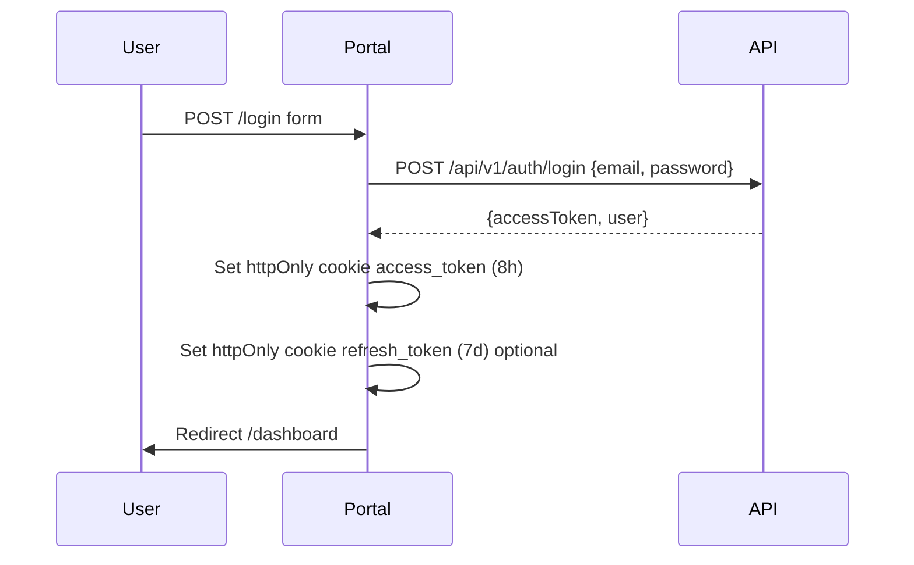
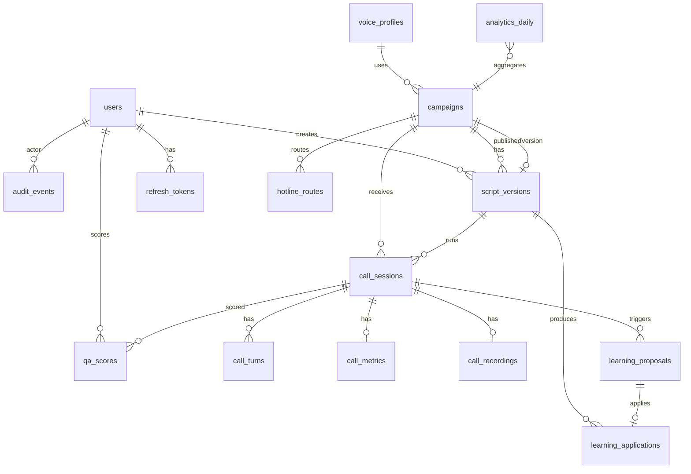

# DoctorCheck AI Portal — Master Plan

> **Single source of truth** cho Claude Code — gộp UX design + implementation plan + PostgreSQL schema.  
> Mục tiêu: **mọi nút, mọi trang hoạt động end-to-end** trên `http://doctorcheck.ai-agent.local`  
> JWT: `JWT_SECRET=change-me-in-production`, `JWT_REFRESH_SECRET=change-me-refresh`  
> Trạng thái khảo sát: 2026-05-26 — Dashboard render OK; DB `users` **0 rows**; `/audit` **404**; API protected → **401** nếu không có token.

**Related docs (không thay thế bởi file này):**
- Script contract: [`call-script-contract-v0.1.md`](call-script-contract-v0.1.md)
- Example script: [`../scripts/examples/booking_inbound_v1.json`](../scripts/examples/booking_inbound_v1.json)

---

## Mục lục

1. [Trạng thái hiện tại & blocker](#1-trạng-thái-hiện-tại--blocker)
2. [Nguyên tắc thiết kế](#2-nguyên-tắc-thiết-kế)
3. [Information Architecture](#3-information-architecture)
4. [Auth & Session](#4-auth--session)
5. [Map từng trang — nút → API](#5-map-từng-trang--nút--api)
6. [API bổ sung (Backend)](#6-api-bổ-sung-backend)
7. [PostgreSQL Schema — hoàn chỉnh](#7-postgresql-schema--hoàn-chỉnh)
8. [Sprint A→F — Implementation](#8-sprint-af--implementation)
9. [Luồng demo E2E](#9-luồng-demo-e2e)
10. [Checklist mọi nút hoạt động](#10-checklist-mọi-nút-hoạt-động)
11. [Implementation todos](#11-implementation-todos)
12. [Ghi chú kỹ thuật & rủi ro](#12-ghi-chú-kỹ-thuật--rủi-ro)

---

## 1. Trạng thái hiện tại & blocker

| Layer | Đã có | Thiếu / broken |
|-------|-------|----------------|
| **Portal** | 14 routes (dashboard, scripts, calls, qa, learning, reports, settings) | `/login`, `/audit` (404); không JWT → API **401** |
| **API** | Auth JWT, scripts CRUD/lint/publish, calls, QA, learning review, audit, settings, internal webhook | Seed users; analytics; PATCH campaign; refresh token |
| **DB** | 8 bảng TypeORM, `synchronize` dev | `users` **0 rows**; target **17 bảng** (thiếu 9) |
| **Voice** | FSM + mock replay + health stub | CloudFone ODS thật (Phase 2) |

**Blocker P0:** [`apps/portal/src/lib/api/client.ts`](../apps/portal/src/lib/api/client.ts) không gửi `Authorization`; SSR pages fetch `API_INTERNAL_URL` không cookie.

**Key paths:**

| Path | Purpose |
|------|---------|
| `apps/portal/` | Next.js 15 portal |
| `apps/api/` | NestJS API |
| `services/voice/` | Python voice worker |
| `packages/shared/` | Zod schemas, RBAC, prosody |

---

## 2. Nguyên tắc thiết kế

| # | Nguyên tắc | Lý do |
|---|------------|-------|
| 1 | **Auth trước, data sau** | Mọi API (trừ `/health`, `/auth/login`) cần JWT — hiện Portal không login → mọi trang trống |
| 2 | **Một client API duy nhất** | Gom `fetch` rải rác + `apiFetch()` → `lib/api/` có auth, error envelope, refresh |
| 3 | **Server Component chỉ đọc qua cookie** | SSR không gọi API nội bộ không token — httpOnly cookie hoặc client + TanStack Query |
| 4 | **Nút = hành động có API** | Mỗi button map 1 endpoint + loading/error/success state |
| 5 | **RBAC hiển thị theo role** | Ẩn/disable Publish, Settings save, Learning approve theo `ROLE_PERMISSIONS` |
| 6 | **Empty state có CTA** | Trống → hướng dẫn bước tiếp (tạo campaign, seed script, mock call) |

---

## 3. Information Architecture

```
/login                          ← THIẾU (blocker P0)
/dashboard                      KPI + system health
/scripts                        Campaign list
/scripts/new                    Tạo campaign
/scripts/[id]                   Version history + workflow
/scripts/[id]/new-version       JSON editor + validate + preview
/scripts/[id]/versions/[ver]    Xem body + workflow actions
/calls                          Call list
/calls/[id]                     Transcript + QA + recording
/qa                             QA queue
/learning                       HITL proposals
/reports                        Analytics charts
/audit                          Audit log ← THIẾU page (404)
/settings                       CloudFone + hotlines (future)
/users                          Admin only ← THIẾU (future S9)
```

**Sidebar:** giữ 8 mục hiện tại; thêm user menu góc phải (avatar, role, logout).

---

## 4. Auth & Session

### 4.1 Flow đăng nhập



### 4.2 Trang `/login`

| Thành phần | Spec |
|------------|------|
| Layout | Full-screen, logo DoctorCheck, không sidebar |
| Fields | Email, Password |
| Submit | `POST /api/v1/auth/login` |
| Error | "Sai email hoặc mật khẩu" |

### 4.3 Middleware Next.js

- Public: `/login`, `/api/*` (rewrite)
- Protected: mọi route khác → redirect `/login` nếu không có cookie
- Pass token: Route Handler đọc cookie → header `Authorization: Bearer`

### 4.4 Refresh token (Sprint F)

- `POST /api/v1/auth/refresh` — sign bằng `JWT_REFRESH_SECRET`
- Portal auto-refresh khi 401
- Bảng `refresh_tokens` (xem schema §7)

### 4.5 Seed users (dev)

| Email | Role | Mật khẩu dev |
|-------|------|--------------|
| admin@doctorcheck.vn | admin | Admin@2024! |
| operator@doctorcheck.vn | operator | Operator@2024! |
| qa@doctorcheck.vn | qa | Qa@2024! |
| viewer@doctorcheck.vn | viewer | Viewer@2024! |

---

## 5. Map từng trang — nút → API

### 5.1 Dashboard `/dashboard`

**Hiện trạng:** KPI toàn 0; health check API/Voice OK; Postgres/Redis fake "operational".

| UI | Hành vi | API |
|----|---------|-----|
| 5 KPI cards | Số thật từ DB | `GET /analytics/overview` **(mới)** |
| System: API Server | Ping | `GET /api/v1/health` |
| System: Voice Worker | Ping + CloudFone | `GET {VOICE}/health` |
| System: PostgreSQL/Redis | Ping qua API | `GET /health/deps` **(mới)** |
| Banner "Chưa có campaign" | → `/scripts/new` | `GET /scripts` count |

**`GET /analytics/overview` response:**

```json
{
  "calls": { "total": 42, "completed": 30, "handoff": 8, "error": 2, "active": 2 },
  "period": "24h",
  "containmentRate": 0.79,
  "avgQaScore": 4.2
}
```

### 5.2 Script CMS `/scripts`

| UI | Hành vi | API | Role |
|----|---------|-----|------|
| **Tạo Campaign** | → `/scripts/new` | — | admin, operator |
| Campaign card click | → detail | `GET /scripts` | all |
| Badge Live | `isActive === true` | — | — |

### 5.3 Tạo Campaign `/scripts/new`

| UI | Hành vi | API |
|----|---------|-----|
| **Tạo Campaign** | Redirect detail | `POST /scripts` `{name, direction, voiceProfile}` |
| **Hủy** | → `/scripts` | — |

### 5.4 Campaign Detail `/scripts/[id]`

**Hiện trạng:** Send/Globe **không có onClick**.

| UI | Hành vi | API | Role |
|----|---------|-----|------|
| **Tạo Version** | → new-version | — | admin, operator |
| **Send** (draft) | Submit review | `POST /scripts/:id/versions/:ver/submit-review` | admin, operator |
| **Globe** (under_review) | Publish | `POST /scripts/:id/versions/:ver/publish` | **admin** |
| Toggle **Live** | Bật/tắt campaign | `PATCH /scripts/:id` `{isActive}` **(mới)** | operator |

### 5.5 New Version `/scripts/[id]/new-version`

| UI | Hành vi | API |
|----|---------|-----|
| **Validate** | L001–L008 panel | `POST /scripts/validate` |
| **Nghe thử** | browser speechSynthesis (Sprint A–E) | — |
| **Nghe thử v2** | Voice TTS (Sprint F) | `POST {VOICE}/preview` |
| **Import mẫu** | booking_inbound_v1.json | static file |
| **Lưu Draft** | Khi valid | `POST /scripts/:id/versions` `{version, body}` |

### 5.6 Version Detail `/scripts/[id]/versions/[version]`

| UI | Hành vi | API |
|----|---------|-----|
| **Submit for Review** | Nếu draft | `POST .../submit-review` |
| **Publish** | under_review + admin | `POST .../publish` |
| **Diff** (Sprint F) | vs published | `GET .../diff?against=published` **(mới)** |
| **Replay mock** | Dialog utterances | `POST {VOICE}/calls/replay` |

### 5.7 Cuộc gọi `/calls`

| UI | Hành vi | API |
|----|---------|-----|
| Table | Paginated | `GET /calls?page&limit&campaignId&status` |
| **Chi tiết →** | → `/calls/[id]` | — |
| **Chạy mock call** (dev) | Voice replay | `POST /internal/call-events` |

### 5.8 Call Detail `/calls/[id]`

**Hiện trạng:** QA form không load session.

| UI | Hành vi | API |
|----|---------|-----|
| Header | SĐT masked, status, duration | `GET /calls/:id` |
| Transcript timeline | Turn-by-turn | `GET /calls/:id/turns` **(mới)** |
| Audio player | Recording | `GET /calls/:id/recording` **(mới)** |
| Metrics | TTFA, barge-in | `call_metrics` |
| **Gửi đánh giá** | QA score | `POST /calls/:id/qa-scores` `{score, notes, tags}` |

### 5.9 QA Review `/qa`

| UI | Hành vi | API |
|----|---------|-----|
| Queue cards | → call detail | `GET /calls/qa-queue` |

### 5.10 Learning `/learning`

**Hiện trạng:** Duyệt/Từ chối **không wire API**.

| UI | Hành vi | API | Role |
|----|---------|-----|------|
| Tabs Pending/Approved/Rejected | Filter | `GET /learning/proposals?status=` | qa, admin |
| **Duyệt** | approve | `POST /learning/proposals/:id/review` `{decision:"approved"}` | qa, admin |
| **Từ chối** | reject | `{decision:"rejected"}` | qa, admin |
| **Apply to draft** | Tạo script version | `POST /learning/proposals/:id/apply` **(mới)** | admin |

### 5.11 Báo cáo `/reports`

| Chart | API |
|-------|-----|
| Cuộc gọi theo ngày | `GET /analytics/calls-by-day` |
| Intent phổ biến | `GET /analytics/intents` |
| Thời lượng TB | `GET /analytics/duration` |
| Điểm QA | `GET /analytics/qa-trends` |

UI: Recharts/Tremor; export CSV.

### 5.12 Audit Log `/audit` — **THIẾU PAGE**

| UI | Hành vi | API |
|----|---------|-----|
| Table | actor, action, entity, time | `GET /audit?limit&offset&entity&action` |
| Diff expand | JSON diff | column `diff` |
| Export CSV | Download | `GET /audit/export` **(mới)** |

Role: **admin only**.

### 5.13 Cài đặt `/settings`

| UI | Hành vi | API | Role |
|----|---------|-----|------|
| **Lưu cài đặt** | CloudFone config | `PUT /settings/cloudfone` | admin |
| **Test connection** | OK/Fail | `POST /settings/cloudfone/test` **(mới)** | admin |
| Hotline routes (Sprint F) | CRUD | hotline API **(mới)** | admin |

Security: API trả apiKey masked `***last4`.

---

## 6. API bổ sung (Backend)

| Priority | Endpoint | Mục đích | Sprint |
|----------|----------|----------|--------|
| P0 | Seed CLI / `POST /dev/seed` | DB trống → login | A |
| P0 | Cookie + Bearer flow | Portal auth | A |
| P1 | `GET /analytics/overview` | Dashboard | C |
| P1 | `GET /health/deps` | Postgres/Redis health | C |
| P1 | `PATCH /scripts/:id` `{isActive}` | Toggle campaign | B |
| P2 | `GET /calls/:id/turns` | Transcript timeline | E |
| P2 | `GET /calls/:id/recording` | Audio URL | E |
| P2 | `POST /internal/call-events` expand | started, step, intent | C/E |
| P2 | `POST /learning/proposals/:id/apply` | HITL → draft script | D |
| P2 | `POST /settings/cloudfone/test` | Test WS | F |
| P3 | Analytics suite | Reports | E |
| P3 | `GET /audit/export` | CSV | D |
| P3 | `POST /auth/refresh` | Refresh token | F |

**Internal auth:** Voice worker → `/internal/*` header `X-Service-Key` (bảng `service_api_keys`).

**Đã có sẵn (wire Portal):**
- `POST /auth/login`, `GET /auth/me`
- `GET/POST /scripts/*`, submit-review, publish
- `GET /calls/*`, `POST /calls/:id/qa-scores`, `GET /calls/qa-queue`
- `GET/POST /learning/proposals/*`, review
- `GET /audit`, `PUT /settings/cloudfone`

---

## 7. PostgreSQL Schema — hoàn chỉnh

**Connection dev:** `postgresql://hiendang@localhost:5432/aivoice`  
**ORM:** TypeORM, camelCase columns, `synchronize: true` (dev only)  
**Production:** `apps/api/src/migrations/` trước Sprint E+

### 7.1 Tổng quan — 17 bảng

| # | Bảng | Sprint | Trạng thái |
|---|------|--------|------------|
| 1 | users | — | ✅ entity |
| 2 | campaigns | B/F | ✅ entity |
| 3 | script_versions | — | ✅ entity |
| 4 | call_sessions | — | ✅ entity |
| 5 | qa_scores | — | ✅ entity |
| 6 | learning_proposals | — | ✅ entity |
| 7 | audit_events | — | ✅ entity |
| 8 | cloudfone_settings | — | ✅ entity |
| 9 | call_metrics | C | 🆕 |
| 10 | service_api_keys | C | 🆕 |
| 11 | analytics_daily | C/E | 🆕 |
| 12 | learning_applications | D | 🆕 |
| 13 | call_turns | E | 🆕 |
| 14 | call_recordings | E | 🆕 |
| 15 | voice_profiles | F | 🆕 |
| 16 | hotline_routes | F | 🆕 |
| 17 | refresh_tokens | F | 🆕 |

### 7.2 ER diagram



### 7.3 DDL đầy đủ (target schema — greenfield)

```sql
-- DoctorCheck AI Voice — PostgreSQL Target Schema v1
-- Database: aivoice

CREATE EXTENSION IF NOT EXISTS "pgcrypto";

CREATE TYPE user_role AS ENUM ('admin', 'operator', 'qa', 'viewer');
CREATE TYPE campaign_direction AS ENUM ('inbound', 'outbound');
CREATE TYPE script_version_status AS ENUM ('draft', 'under_review', 'published', 'archived');
CREATE TYPE call_status AS ENUM ('active', 'completed', 'handoff', 'error');
CREATE TYPE call_direction AS ENUM ('inbound', 'outbound');
CREATE TYPE proposal_type AS ENUM ('new_intent_example', 'edit_variant', 'add_reprompt', 'slot_correction');
CREATE TYPE proposal_status AS ENUM ('pending', 'approved', 'rejected');
CREATE TYPE turn_role AS ENUM ('agent', 'caller', 'system');
CREATE TYPE learning_application_status AS ENUM ('applied', 'failed');

CREATE TABLE users (
  id uuid PRIMARY KEY DEFAULT gen_random_uuid(),
  email varchar NOT NULL UNIQUE,
  "passwordHash" varchar NOT NULL,
  "fullName" varchar NOT NULL,
  role user_role NOT NULL DEFAULT 'viewer',
  "isActive" boolean NOT NULL DEFAULT true,
  "createdAt" timestamptz NOT NULL DEFAULT now(),
  "updatedAt" timestamptz NOT NULL DEFAULT now(),
  "deletedAt" timestamptz NULL
);
CREATE INDEX idx_users_role ON users (role) WHERE "deletedAt" IS NULL;

CREATE TABLE voice_profiles (
  id varchar PRIMARY KEY,
  "displayName" varchar NOT NULL,
  "ttsEngine" varchar NOT NULL DEFAULT 'qwen-tts',
  "ttsVoiceId" varchar NOT NULL,
  "sampleRate" int NOT NULL DEFAULT 8000,
  "prosodyPreset" jsonb NULL,
  "isActive" boolean NOT NULL DEFAULT true,
  "createdAt" timestamptz NOT NULL DEFAULT now(),
  "updatedAt" timestamptz NOT NULL DEFAULT now()
);

CREATE TABLE campaigns (
  id uuid PRIMARY KEY DEFAULT gen_random_uuid(),
  name varchar NOT NULL,
  direction campaign_direction NOT NULL,
  "voiceProfile" varchar NOT NULL,
  "voiceProfileId" varchar NULL REFERENCES voice_profiles(id) ON DELETE SET NULL,
  "isActive" boolean NOT NULL DEFAULT false,
  "publishedVersionId" uuid NULL,
  "createdAt" timestamptz NOT NULL DEFAULT now(),
  "updatedAt" timestamptz NOT NULL DEFAULT now()
);
CREATE INDEX idx_campaigns_active ON campaigns ("isActive") WHERE "isActive" = true;

CREATE TABLE script_versions (
  id uuid PRIMARY KEY DEFAULT gen_random_uuid(),
  "campaignId" uuid NOT NULL REFERENCES campaigns(id) ON DELETE CASCADE,
  version varchar NOT NULL,
  body jsonb NOT NULL,
  status script_version_status NOT NULL DEFAULT 'draft',
  "reviewNote" text NULL,
  "createdBy" uuid NULL REFERENCES users(id) ON DELETE SET NULL,
  "publishedAt" timestamptz NULL,
  "createdAt" timestamptz NOT NULL DEFAULT now(),
  "updatedAt" timestamptz NOT NULL DEFAULT now(),
  UNIQUE ("campaignId", version)
);
CREATE INDEX idx_script_versions_campaign_status ON script_versions ("campaignId", status);

ALTER TABLE campaigns ADD CONSTRAINT fk_campaigns_published_version
  FOREIGN KEY ("publishedVersionId") REFERENCES script_versions(id) ON DELETE SET NULL;

CREATE TABLE hotline_routes (
  id uuid PRIMARY KEY DEFAULT gen_random_uuid(),
  "hotlineNumber" varchar NOT NULL UNIQUE,
  "campaignId" uuid NOT NULL REFERENCES campaigns(id) ON DELETE CASCADE,
  "isActive" boolean NOT NULL DEFAULT true,
  "createdAt" timestamptz NOT NULL DEFAULT now(),
  "updatedAt" timestamptz NOT NULL DEFAULT now()
);

CREATE TABLE call_sessions (
  id uuid PRIMARY KEY DEFAULT gen_random_uuid(),
  "sessionId" varchar NOT NULL UNIQUE,
  "campaignId" uuid NULL REFERENCES campaigns(id) ON DELETE SET NULL,
  "scriptVersionId" uuid NULL REFERENCES script_versions(id) ON DELETE SET NULL,
  direction call_direction NOT NULL DEFAULT 'inbound',
  "callerNumberMasked" varchar NULL,
  status call_status NOT NULL DEFAULT 'active',
  transcript jsonb NULL,
  slots jsonb NULL,
  "finalStepId" varchar NULL,
  "durationSeconds" int NULL,
  "startedAt" timestamptz NULL,
  "endedAt" timestamptz NULL,
  "createdAt" timestamptz NOT NULL DEFAULT now(),
  "updatedAt" timestamptz NOT NULL DEFAULT now()
);
CREATE INDEX idx_call_sessions_campaign_created ON call_sessions ("campaignId", "createdAt" DESC);

CREATE TABLE call_turns (
  id uuid PRIMARY KEY DEFAULT gen_random_uuid(),
  "callSessionId" uuid NOT NULL REFERENCES call_sessions(id) ON DELETE CASCADE,
  seq int NOT NULL,
  role turn_role NOT NULL,
  "stepId" varchar NULL,
  intent varchar NULL,
  text text NOT NULL DEFAULT '',
  "audioOffsetMs" int NULL,
  "latencyMs" int NULL,
  metadata jsonb NULL,
  "createdAt" timestamptz NOT NULL DEFAULT now(),
  UNIQUE ("callSessionId", seq)
);

CREATE TABLE call_metrics (
  id uuid PRIMARY KEY DEFAULT gen_random_uuid(),
  "callSessionId" uuid NOT NULL UNIQUE REFERENCES call_sessions(id) ON DELETE CASCADE,
  "ttfaMs" int NULL,
  "avgTurnLatencyMs" int NULL,
  "bargeInCount" int NOT NULL DEFAULT 0,
  "noMatchCount" int NOT NULL DEFAULT 0,
  "repromptCount" int NOT NULL DEFAULT 0,
  "stepCount" int NULL,
  "createdAt" timestamptz NOT NULL DEFAULT now()
);

CREATE TABLE call_recordings (
  id uuid PRIMARY KEY DEFAULT gen_random_uuid(),
  "callSessionId" uuid NOT NULL UNIQUE REFERENCES call_sessions(id) ON DELETE CASCADE,
  "storageKey" varchar NOT NULL,
  format varchar NOT NULL DEFAULT 'wav',
  "durationSeconds" int NOT NULL,
  "sizeBytes" bigint NULL,
  "createdAt" timestamptz NOT NULL DEFAULT now()
);

CREATE TABLE qa_scores (
  id uuid PRIMARY KEY DEFAULT gen_random_uuid(),
  "callSessionId" uuid NOT NULL REFERENCES call_sessions(id) ON DELETE CASCADE,
  "scoredBy" uuid NOT NULL REFERENCES users(id) ON DELETE RESTRICT,
  score smallint NOT NULL CHECK (score BETWEEN 1 AND 5),
  notes text NULL,
  tags jsonb NOT NULL DEFAULT '[]'::jsonb,
  "createdAt" timestamptz NOT NULL DEFAULT now(),
  "updatedAt" timestamptz NOT NULL DEFAULT now()
);

CREATE TABLE learning_proposals (
  id uuid PRIMARY KEY DEFAULT gen_random_uuid(),
  "callSessionId" uuid NULL REFERENCES call_sessions(id) ON DELETE SET NULL,
  type proposal_type NOT NULL,
  payload jsonb NOT NULL,
  status proposal_status NOT NULL DEFAULT 'pending',
  "reviewedBy" uuid NULL REFERENCES users(id) ON DELETE SET NULL,
  "reviewNote" text NULL,
  "reviewedAt" timestamptz NULL,
  "createdAt" timestamptz NOT NULL DEFAULT now(),
  "updatedAt" timestamptz NOT NULL DEFAULT now()
);
CREATE INDEX idx_learning_proposals_status ON learning_proposals (status, "createdAt" DESC);

CREATE TABLE learning_applications (
  id uuid PRIMARY KEY DEFAULT gen_random_uuid(),
  "proposalId" uuid NOT NULL UNIQUE REFERENCES learning_proposals(id) ON DELETE CASCADE,
  "targetCampaignId" uuid NOT NULL REFERENCES campaigns(id) ON DELETE CASCADE,
  "resultVersionId" uuid NULL REFERENCES script_versions(id) ON DELETE SET NULL,
  "appliedBy" uuid NOT NULL REFERENCES users(id) ON DELETE RESTRICT,
  "appliedAt" timestamptz NOT NULL DEFAULT now(),
  status learning_application_status NOT NULL DEFAULT 'applied'
);

CREATE TABLE analytics_daily (
  id uuid PRIMARY KEY DEFAULT gen_random_uuid(),
  date date NOT NULL,
  "campaignId" uuid NULL REFERENCES campaigns(id) ON DELETE CASCADE,
  "totalCalls" int NOT NULL DEFAULT 0,
  "completedCalls" int NOT NULL DEFAULT 0,
  "handoffCalls" int NOT NULL DEFAULT 0,
  "errorCalls" int NOT NULL DEFAULT 0,
  "avgDurationSeconds" numeric(10,2) NOT NULL DEFAULT 0,
  "avgQaScore" numeric(4,2) NULL,
  "containmentRate" numeric(5,4) NOT NULL DEFAULT 0,
  "createdAt" timestamptz NOT NULL DEFAULT now(),
  "updatedAt" timestamptz NOT NULL DEFAULT now(),
  UNIQUE (date, "campaignId")
);

CREATE TABLE audit_events (
  id uuid PRIMARY KEY DEFAULT gen_random_uuid(),
  "actorId" varchar NOT NULL,
  "actorEmail" varchar NOT NULL,
  action varchar NOT NULL,
  entity varchar NOT NULL,
  "entityId" varchar NULL,
  diff jsonb NULL,
  "ipAddress" varchar NULL,
  "createdAt" timestamptz NOT NULL DEFAULT now()
);
CREATE INDEX idx_audit_actor ON audit_events ("actorId", "createdAt" DESC);

CREATE TABLE cloudfone_settings (
  id varchar PRIMARY KEY DEFAULT 'default',
  "odsUrl" varchar NOT NULL DEFAULT '',
  "apiKey" varchar NOT NULL DEFAULT '',
  "tenantId" varchar NOT NULL DEFAULT '',
  "updatedBy" uuid NULL REFERENCES users(id) ON DELETE SET NULL,
  "updatedAt" timestamptz NOT NULL DEFAULT now()
);

CREATE TABLE service_api_keys (
  id uuid PRIMARY KEY DEFAULT gen_random_uuid(),
  name varchar NOT NULL UNIQUE,
  "keyHash" varchar NOT NULL,
  "isActive" boolean NOT NULL DEFAULT true,
  "createdAt" timestamptz NOT NULL DEFAULT now()
);

CREATE TABLE refresh_tokens (
  id uuid PRIMARY KEY DEFAULT gen_random_uuid(),
  "userId" uuid NOT NULL REFERENCES users(id) ON DELETE CASCADE,
  jti varchar NOT NULL UNIQUE,
  "expiresAt" timestamptz NOT NULL,
  "revokedAt" timestamptz NULL,
  "createdAt" timestamptz NOT NULL DEFAULT now()
);
```

### 7.4 Ràng buộc nghiệp vụ

| Rule | Enforce tại |
|------|-------------|
| 1 published version / campaign | `ScriptsService.publishVersion()` |
| Publish → `publishedVersionId` + Redis `script:active:{id}` | `ScriptsService.publishVersion()` |
| `audit_events` immutable | Service chỉ INSERT |
| HITL: approve → apply tạo draft, không auto-publish | `LearningService.applyProposal()` |
| PII: chỉ `callerNumberMasked` | `CallsService.maskPhone()` |
| Internal webhook | `service_api_keys` vs `X-Service-Key` |

### 7.5 JSONB shapes

- **`script_versions.body`:** Call Script Contract v0.1 — xem [`call-script-contract-v0.1.md`](call-script-contract-v0.1.md)
- **`call_sessions.slots`:** `{ "appointment_date": "2026-05-28" }`
- **`call_turns.metadata`:** `{ "bargeIn": true, "noMatch": false }`
- **`learning_proposals.payload`:** `{ "stepId", "intentName", "suggestedExamples" }`
- **`audit_events.diff`:** `{ "before": {}, "after": {} }`

### 7.6 Rollout incremental (DB hiện có 8 bảng)

| Sprint | Migration | Seed |
|--------|-----------|------|
| **A** | — | 4 users, cloudfone_settings, audit seed |
| **B** | `campaigns.publishedVersionId` | — |
| **C** | `call_metrics`, `service_api_keys` | voice-worker key |
| **D** | `learning_applications` | — |
| **E** | `call_turns`, `call_recordings`, `analytics_daily` | mock turns |
| **F** | `voice_profiles`, `hotline_routes`, `refresh_tokens` | `linh_v1` |

**Gap entity vs target:** `scoredBy`, `createdBy`, `actorId` hiện là `varchar` — target DDL dùng FK uuid (optional migration Sprint A).

### 7.7 Redis

| Key | Value | Set khi |
|-----|-------|---------|
| `script:active:{campaignId}` | JSON script body | publish |
| `session:{sessionId}` | FSM state | voice worker |
| `refresh:{userId}` | refresh jti | login |

---

## 8. Sprint A→F — Implementation

| Sprint | Backend | Portal | Schema | Pages unlocked |
|--------|---------|--------|--------|----------------|
| **A** | Seed CLI, `/dev/seed` | `/login`, middleware, `lib/api/server.ts`, user menu | Seed only | All list pages có data |
| **B** | `PATCH /scripts/:id`, publish → `publishedVersionId` | Wire Submit/Publish/Live toggle | `publishedVersionId` | Script CMS full |
| **C** | `/analytics/overview`, `/health/deps`, expand webhook | Call detail, QA, dashboard KPIs | `call_metrics`, `service_api_keys` | Dashboard, Calls, QA |
| **D** | `/learning/proposals/:id/apply` | `/audit` page, Learning wire | `learning_applications` | Audit, Learning |
| **E** | Analytics suite, turns/recording API | Reports charts, timeline, audio | `call_turns`, `call_recordings` | Reports, Call detail |
| **F** | `/auth/refresh`, CloudFone test | Visual editor, TTS preview | `voice_profiles`, `hotline_routes`, `refresh_tokens` | Pro UX |

### Sprint A — chi tiết

**Backend:** `apps/api/src/` seed script; bcrypt via UsersService; audit `seed.users`  
**Portal:**
- `apps/portal/src/app/login/page.tsx`
- `apps/portal/src/app/api/auth/login/route.ts` + logout
- `apps/portal/src/middleware.ts`
- `apps/portal/src/lib/api/server.ts` + refactor `client.ts`
- RBAC UI từ `packages/shared/src/types/rbac.ts`

**Verify:** Login admin → `/scripts` không 401.

### Sprint B — chi tiết

Wire onClick trong:
- `apps/portal/src/app/scripts/[id]/page.tsx`
- `apps/portal/src/app/scripts/[id]/versions/[version]/page.tsx`

Endpoints đã có: `submit-review`, `publish` trong `scripts.controller.ts`.

---

## 9. Luồng demo E2E

```
1. Seed 4 users + audit log
2. Login admin → Dashboard KPI (có thể 0)
3. Settings → lưu CloudFone mock URL → test OK
4. Scripts → Tạo campaign "Booking Inbound"
5. New version → Import booking_inbound_v1.json → Validate → Lưu Draft
6. Submit review (operator) → Publish (admin) → campaign Live
7. Voice replay mock → POST /internal/call-events → Call trong /calls
8. QA → score call → biến mất khỏi queue
9. Learning → auto proposal → QA approve → apply draft
10. Reports → charts có data
11. Audit → publish + settings + review events
```

---

## 10. Checklist mọi nút hoạt động

| Trang | Nút / Action | Hiện tại | Target |
|-------|--------------|----------|--------|
| Login | Đăng nhập | ❌ no page | ✅ Sprint A |
| Dashboard | KPI | ⚠️ fake 0 | ✅ Sprint C |
| Scripts | Tạo Campaign | ⚠️ 401 | ✅ Sprint A |
| Scripts/[id] | Send / Publish | ❌ no handler | ✅ Sprint B |
| New version | Validate / Lưu | ⚠️ 401 | ✅ Sprint A |
| Calls | Chi tiết | ⚠️ empty | ✅ Sprint C |
| Call/[id] | Gửi QA | ⚠️ no load | ✅ Sprint C |
| Learning | Duyệt / Từ chối | ❌ no handler | ✅ Sprint D |
| Reports | Charts | ❌ placeholder | ✅ Sprint E |
| Audit | Page | ❌ 404 | ✅ Sprint D |
| Settings | Lưu | ⚠️ 401 | ✅ Sprint A |

---

## 11. Implementation todos

Thực hiện **theo thứ tự** — Sprint A blocker cho tất cả:

- [ ] **Sprint A:** Seed users + `/login` + middleware + httpOnly cookie + `lib/api/server.ts` + refactor SSR
- [ ] **Schema A:** Seed data (users, cloudfone_settings default) — không DDL
- [ ] **Sprint B:** PATCH campaign isActive + wire Submit/Publish workflow
- [ ] **Schema B:** `campaigns.publishedVersionId` FK
- [ ] **Sprint C:** analytics/overview + call detail + QA + dashboard + mock replay
- [ ] **Schema C:** `call_metrics`, `service_api_keys`
- [ ] **Sprint D:** `/audit` page + Learning review/apply
- [ ] **Schema D:** `learning_applications`
- [ ] **Sprint E:** Reports charts + call turns/recording UI
- [ ] **Schema E:** `call_turns`, `call_recordings`, `analytics_daily`
- [ ] **Sprint F:** Visual editor + TTS preview + refresh token + CloudFone test
- [ ] **Schema F:** `voice_profiles`, `hotline_routes`, `refresh_tokens`

---

## 12. Ghi chú kỹ thuật & rủi ro

**Portal:**
- Rewrite `/api/*` → NestJS (`apps/portal/next.config.ts`)
- SSR: dùng `lib/api/server.ts` đọc cookie → Bearer
- TanStack Query: adopt từ Sprint C cho client pages
- Refresh token: env có, AuthService chưa implement — Sprint F

**Rủi ro:**
- Phải xong Sprint A trước — tránh patch từng page riêng lẻ
- `synchronize` OK dev; Sprint E+ cần migration prod
- `call_sessions.transcript` jsonb deprecate sau Sprint E (dual-write với `call_turns`)
- CloudFone ODS thật ngoài scope A–E; mock replay đủ demo
- Recordings retention cần legal sign-off DoctorCheck

---

*Master plan v1 — merged from portal-ux-design-v1 + E2E implementation plan + PostgreSQL schema.*
