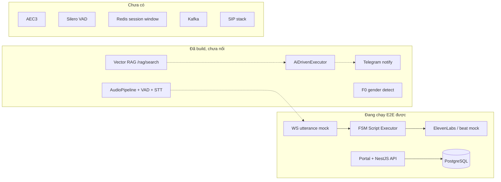
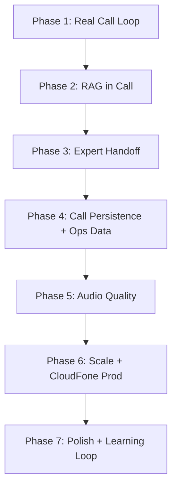
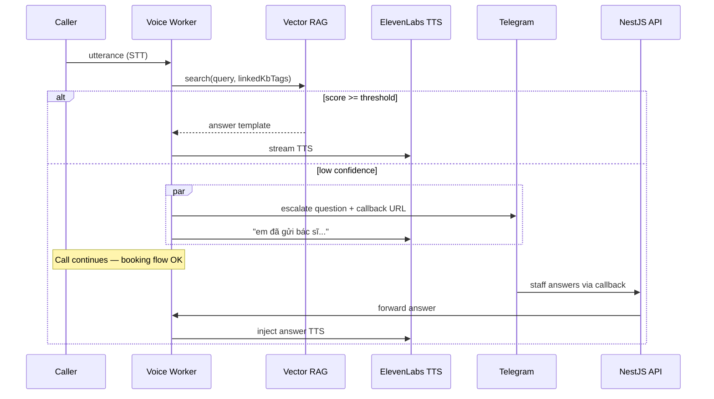

# DoctorCheck AI Call — Implementation Plan

> **Single source of truth** cho Phase 2+ (Voice + RAG + Production readiness).  
> Gộp vision Gemini (đã lọc) + as-built codebase + invariant dự án (`CLAUDE.md`, master plan).  
> Trạng thái: 2026-05-28 · v1.1 (thêm quy trình `/reload` + `/dev-loop`)

**Related docs:**
- Portal master plan: [`doctorcheck-portal-master-plan.md`](doctorcheck-portal-master-plan.md)
- Script contract: [`call-script-contract-v0.1.md`](call-script-contract-v0.1.md)
- Architecture overview: [`../CLAUDE.md`](../CLAUDE.md)
- Verify skills: [`.claude/skills/reload/SKILL.md`](../.claude/skills/reload/SKILL.md), [`.claude/skills/dev-loop/SKILL.md`](../.claude/skills/dev-loop/SKILL.md)

---

## Mục lục

1. [Baseline — đang ở đâu](#1-baseline--đang-ở-đâu)
2. [Ma trận ưu tiên](#2-ma-trận-ưu-tiên)
3. [KHÔNG NÊN LÀM (reject list)](#3-không-nên-làm-reject-list)
4. [Quy trình verify — /reload + /dev-loop](#4-quy-trình-verify--reload--dev-loop)
5. [Roadmap theo phase](#5-roadmap-theo-phase)
6. [Phase 1 — Real Call Loop](#phase-1--real-call-loop)
7. [Phase 2 — RAG in Call](#phase-2--rag-in-call)
8. [Phase 3 — Expert Handoff (Telegram async)](#phase-3--expert-handoff-telegram-async)
9. [Phase 4 — Call Persistence & Ops Data](#phase-4--call-persistence--ops-data)
10. [Phase 5 — Audio Quality](#phase-5--audio-quality)
11. [Phase 6 — CloudFone Production](#phase-6--cloudfone-production)
12. [Phase 7 — Polish, Learning Loop, Governance](#phase-7--polish-learning-loop-governance)
13. [Deferred Issues Backlog](#deferred-issues-backlog)
14. [Bảng tổng hợp PHẢI / CẦN / NÊN](#6-bảng-tổng-hợp-phải--cần--nên)
15. [Dependency graph](#7-dependency-graph)
16. [Sprint gợi ý](#8-sprint-gợi-ý-810-tuần)
17. [Exit criteria toàn hệ thống](#9-exit-criteria-toàn-hệ-thống)
18. [Rủi ro & mitigations](#10-rủi-ro--mitigations)
19. [Tài liệu cần bổ sung](#11-tài-liệu-cần-bổ-sung)

---

## 1. Baseline — đang ở đâu

### Đã xong (không quay lại trừ khi bug)

| Layer | Deliverable |
|-------|-------------|
| **Portal** | Auth, dashboard KPI, scripts CMS, calls/QA, learning HITL UI, reports + XLSX, KB CMS, settings |
| **API** | NestJS modules, analytics, callbacks entity, internal webhooks scaffold, RBAC API |
| **Voice** | FSM executor, mock WS (`utterance`), ElevenLabs TTS, STT engines, fillers, vector RAG API, gender detect, Telegram send, `AiDrivenExecutor` (unit-tested) |

### Gap cốt lõi

Mọi phase phía dưới xoay quanh 5 gap này:

1. **Real audio path chưa chạy** — `/ws/call` chỉ E2E qua mock text
2. **Hai RAG tách rời** — vector store vs LLM-only trong `AiDrivenExecutor`
3. **Handoff loop đứt** — Telegram publish / Redis / WS không khép
4. **Call lifecycle chưa persist từ voice** — `nestjs_webhook_url` không được gọi từ WS
5. **Script contract chưa có `linkedKbTags` / `ai_driven` formal**



---

## 2. Ma trận ưu tiên

| Nhãn | Ý nghĩa | Quy tắc |
|------|---------|---------|
| **PHẢI LÀM** | Blocker production demo / an toàn y tế | Không skip, không song song infra nặng |
| **CẦN LÀM** | Product hoàn chỉnh theo brief (đã chỉnh từ Gemini) | Sau PHẢI LÀM, trước polish |
| **NÊN LÀM** | Chất lượng call, scale, ops | Khi P0/P1 ổn + có data thật |
| **KHÔNG NÊN LÀM** | Over-engineering / lệch phase | Defer hoặc reject vĩnh viễn |

---

## 3. KHÔNG NÊN LÀM (reject list)

Giữ list này để tránh lệch hướng khi implement.

| Item | Lý do reject |
|------|--------------|
| **gRPC cho call streaming** | CloudFone path = WebSocket JSON; thêm gRPC = cost không giải quyết gap hiện tại |
| **SIP ACK/BYE trong voice worker** | SIP thuộc CloudFone gateway; worker nhận `hangup` + metadata. Billing duration lấy từ CDR gateway hoặc `startedAt/endedAt` do ODS báo |
| **Kafka dump on BYE** | Zero consumer thứ 2; Postgres + `POST /internal/call-events` đủ cho QA/dashboard |
| **Celery worker fleet** | FastAPI async + Redis timer đủ cho timeout 30–60s |
| **Markdown làm KB source of truth** | TTS cần `answerText` + gender variants + threshold; Markdown chỉ hợp nếu compile → structured lúc publish |
| **LLM generate câu trả lời tự do** (`AiDrivenExecutor._rag_query`) | Rủi ro hallucination y tế; chỉ TTS template từ KB hoặc script beat |
| **Auto-publish learning** | Vi phạm invariant HITL — QA duyệt, Admin apply draft |
| **Đổi VectorDB mới** (Pinecone, Weaviate…) | In-memory + PG export đủ phase này; metadata filter là app logic |
| **WebRTC AEC3 full stack ngay sprint đầu** | Nặng; làm sau khi đo false barge-in trên line thật |
| **Formalize 3-tier confidence** trước khi binary gate chạy ổn | YAGNI — thêm tier sau khi có log score thật |

---

## 4. Quy trình verify — /reload + /dev-loop

**Bắt buộc:** Mỗi implementation phase (1→7) **phải** kết thúc bằng chuỗi verify trước khi đánh dấu phase done hoặc chuyển phase tiếp theo.

### Chuỗi verify chuẩn (mọi phase)

```
Implement tasks của phase
        │
        ▼
   /reload          ← build + restart stack + health check
        │
        ▼
   /dev-loop        ← build → logs → pytest/health → fix (tối đa 5 vòng)
        │
        ▼
   Phase smoke      ← test thủ công theo checklist phase (bên dưới)
        │
        ▼
   Phase gate        ← exit criteria phase hiện tại PASS?
        │                    │
        │ Có                 │ Không (lỗi thuộc phase hiện tại)
        ▼                    ▼
   Chuyển phase tiếp     Quay /dev-loop hoặc fix
```

### Quy tắc phân loại lỗi

| Loại | Hành vi | Ví dụ |
|------|---------|-------|
| **Blocker phase hiện tại** | Fix ngay trong `/dev-loop`; **không** chuyển phase | Build fail, worker crash, audio path không chạy (Phase 1) |
| **Deferred — phase sau** | Ghi vào [Deferred Issues Backlog](#deferred-issues-backlog); **tiếp tục** nếu exit criteria phase hiện tại đã PASS | Telegram không inject (Phase 3) khi đang verify Phase 1; RAG miss (Phase 2) khi test audio only |
| **External** | Báo user; không loop vô hạn | Postgres/Redis down, `.env` thiếu key, ODS schema chưa có |
| **Pre-existing** | Ghi backlog; fix nếu blocker build/health, else defer | Portal RBAC UI (Phase 7), learning apply merge (Phase 7) |

**Nguyên tắc defer:** Lỗi thuộc phase **N+k** → ghi `DEF-{phase}-{mô tả ngắn}` vào backlog, **không** mở scope phase hiện tại. Xử lý đúng phase được gán.

### /reload — checklist tối thiểu

Theo skill `reload`:

1. `pnpm --filter api build` + `pnpm --filter portal build` — **FAIL → dừng, không restart**
2. `pm2 restart ai-voice-api ai-voice-portal ai-voice-worker` (hoặc subset theo loại thay đổi)
3. Health: API `:3001`, Portal `:3000`, Worker `:8000` — tất cả **UP**
4. In **RELOAD REPORT** (PASS/FAIL từng service)

| Thay đổi chủ yếu | Restart tối thiểu |
|------------------|-------------------|
| `services/voice/` | `ai-voice-worker` |
| `apps/api/` | build API + `ai-voice-api` |
| `apps/portal/` | `ai-voice-portal` |
| Cross-cutting | full `/reload` |

### /dev-loop — checklist tối thiểu

Theo skill `dev-loop` (tối đa **5 vòng**):

1. **BUILD** — API + Portal compile OK
2. **RESTART & LOGS** — không `Error`, `Traceback`, `ImportError` trong pm2 logs
3. **TEST** — `uv run pytest tests/ -v` (voice); health curl API + worker
4. **FIX** — chỉ lỗi blocker phase hiện tại; defer lỗi phase sau
5. **DONE REPORT** hoặc **ESCALATION** (hết 5 vòng)

### Phase gate — khi nào được chuyển phase

Chuyển phase **N → N+1** khi **đồng thời**:

- [ ] `/reload` PASS (stack UP)
- [ ] `/dev-loop` DONE (0 test fail liên quan phase N; pre-existing defer OK)
- [ ] Exit criteria phase N (checkbox bên dưới) — **chỉ criteria thuộc phase N**
- [ ] Deferred backlog đã cập nhật cho mọi lỗi phase sau phát hiện trong verify

---

## 5. Roadmap theo phase



**Nguyên tắc sequencing:** mỗi phase có **exit criteria** đo được + **verify bắt buộc** (`/reload` → `/dev-loop` → phase smoke) trước khi sang phase tiếp.

---

## Phase 1 — Real Call Loop

**Nhãn:** PHẢI LÀM · **Ước lượng:** 1–2 sprint

### Mục tiêu

Simulator + CloudFone mock gửi `audio_frame` (μ-law 8kHz) → STT → turn handler → TTS stream. TTFA đo được trên path thật.

### Việc cụ thể

| # | Task | Ghi chú |
|---|------|---------|
| 1.1 | Wire `AudioPipeline` + `app.state.stt` vào `ws.py` background task | Docstring Task A/B đã vẽ; `transcript_queue` hiện dead code |
| 1.2 | Adapter STT async (ElevenLabs) vs sync (faster-whisper) | Một interface thống nhất trong pipeline |
| 1.3 | Unified VAD cho EOU + barge-in | Bỏ duplicate RMS logic trong `ws.py` |
| 1.4 | `tts_active` + barge-in trên greeting và mọi TTS step | Post-barge-in: flush buffer → STT → `process_utterance` |
| 1.5 | Simulator gửi `audio_frame` thay vì chỉ `utterance` | Giữ `utterance` mode cho CI nhanh |
| 1.6 | Integration test: audio_frame → transcript → TTS | Hiện chưa có |

### Key paths

| Path | Purpose |
|------|---------|
| `services/voice/api/routers/ws.py` | WS handler — cần wire pipeline |
| `services/voice/audio/pipeline.py` | AudioPipeline — đã có, chưa integrate |
| `services/voice/stt/vad.py` | VADDetector — dùng thống nhất |
| `services/voice/simulator/call_simulator.py` | Thêm audio_frame mode |

### Exit criteria

- [ ] Simulator chạy full audio path không cần mock text
- [ ] TTFA logged trên first `audio_chunk`
- [ ] Barge-in cắt TTS trong test có kiểm soát

### Verify (bắt buộc trước khi sang Phase 2)

```
/reload  →  /dev-loop  →  Phase 1 smoke
```

| Bước | Kiểm tra | Thuộc phase |
|------|----------|-------------|
| `/reload` | Stack UP; worker log không crash on WS connect | P1 |
| `/dev-loop` | `pytest tests/test_ws_pipeline.py tests/test_stt.py` PASS | P1 |
| Smoke | Simulator `audio_frame` → nhận `audio_chunk` hoặc beat + transcript log | P1 |
| Smoke | Barge-in: gửi frame trong lúc TTS → stream dừng | P1 |

**Defer (ghi backlog, không fix trong Phase 1):**

| ID gợi ý | Lỗi / gap | Xử lý ở |
|----------|-----------|---------|
| DEF-2-* | RAG không trả lời / score thấp | Phase 2 |
| DEF-3-* | Telegram không gửi / không inject answer | Phase 3 |
| DEF-4-* | Call không xuất hiện trong `/calls` sau hangup | Phase 4 |
| DEF-5-* | False barge-in do echo / cần Silero | Phase 5 |

### Không làm trong phase này

RAG, Telegram, Redis session, Silero, AEC.

---

## Phase 2 — RAG in Call

**Nhãn:** PHẢI LÀM · **Ước lượng:** 1–2 sprint

### Mục tiêu

STT → vector search → TTS template answer. **Một đường duy nhất** — không còn LLM-only "fake RAG".

### Việc cụ thể

| # | Task | Ghi chú |
|---|------|---------|
| 2.1 | **Deprecate** `AiDrivenExecutor._rag_query()` LLM path | Merge logic vào turn handler chung |
| 2.2 | Turn flow: embed utterance → `rag/store.search()` → resolve answer | Dùng `answerMale/Female/unknown` + `{{pronoun}}` |
| 2.3 | Wire gender detect vào pipeline | F0 từ PCM buffer trước STT flush hoặc rolling window |
| 2.4 | Filler ngay sau EOU, trước RAG | `thinking` pool đã có; target ≤50ms beat hoặc pre-cache PCM |
| 2.5 | Binary confidence gate | `score >= confidenceThreshold` → TTS; else → Phase 3 handoff |
| 2.6 | Formalize script mode trong contract | Thêm `execution_mode: "fsm" \| "rag_assisted"` vào schema v0.2 |
| 2.7 | FSM scripts: giữ nguyên | Booking flow vẫn step-based; RAG cho `rag_assisted` hoặc step `type: kb_lookup` |
| 2.8 | `linkedKbTags` metadata filter trong `rag/store.search()` | `tags`/`category` đã có trong DB, chưa dùng khi search |

### Schema / contract (Phase 2)

**Campaign hoặc ScriptVersion thêm:**

```json
{
  "linkedKbTags": ["booking", "pricing"],
  "linkedKbCategories": ["schedule"],
  "ragFallbackMessage": "Dạ em kiểm tra thêm ạ"
}
```

**Không bắt buộc Markdown** — giữ Portal form CMS hiện tại (`knowledge_articles`).

### Exit criteria

- [ ] Câu hỏi có trong KB → TTS đúng template, không LLM paraphrase
- [ ] Câu ngoài KB → rơi vào handoff path (Phase 3)
- [ ] Filter KB theo tag giảm cross-campaign false match (A/B với log)

### Verify (bắt buộc trước khi sang Phase 3)

```
/reload  →  /dev-loop  →  Phase 2 smoke
```

| Bước | Kiểm tra | Thuộc phase |
|------|----------|-------------|
| `/reload` | Worker reload sau thay đổi `rag/`, `ws.py` | P2 |
| `/dev-loop` | `pytest tests/test_rag_store.py tests/test_ai_executor.py` PASS (hoặc update test khi deprecate LLM path) | P2 |
| Smoke | KB article embed + search qua call: câu match → TTS template text đúng | P2 |
| Smoke | Câu ngoài KB → **không** TTS hallucinate; trigger handoff stub OK | P2 |
| Smoke | `linkedKbTags` filter: câu thuộc tag A không match article tag B | P2 |
| Regression | Phase 1 audio path vẫn PASS (mock utterance + audio_frame) | P1 |

**Defer (ghi backlog, không fix trong Phase 2):**

| ID gợi ý | Lỗi / gap | Xử lý ở |
|----------|-----------|---------|
| DEF-3-* | Telegram send fail / callback URL rỗng / answer không inject | Phase 3 |
| DEF-3-* | Timeout 60s / after-hours template | Phase 3 |
| DEF-4-* | `noMatch` không persist vào `call_turns` | Phase 4 |
| DEF-5-* | Gender detect không ổn trên line thật | Phase 5 |

---

## Phase 3 — Expert Handoff (Telegram async)

**Nhãn:** PHẢI LÀM · **Ước lượng:** 1 sprint

### Mục tiêu

Low confidence → song song: TTS "em đã gửi bác sĩ…" + Telegram. Cuộc gọi **không block**.

### Việc cụ thể

| # | Task | Ghi chú |
|---|------|---------|
| 3.1 | `PendingQuestion` trong `SessionState` | `question_id`, text, status, `created_at` |
| 3.2 | Telegram `callback_url` thật | Portal page hoặc deep link `/callbacks/answer?session=&q=` |
| 3.3 | NestJS: `POST /internal/question-answered` → forward voice `/callbacks/question/...` | Hiện chỉ INSERT DB |
| 3.4 | Voice WS: Redis subscriber `answer:{sessionId}` hoặc inline `QUESTION_ANSWERED` event | Consume `answer_queue` đã khai báo |
| 3.5 | Inject answer vào turn tiếp theo hoặc interrupt nhẹ | TTS template: "Dạ về câu hỏi ban nãy…" |
| 3.6 | Config timeout: **60s default** (không 300s) | `notify_settings.questionTimeoutSeconds` |
| 3.7 | Timeout handler: **asyncio task / Redis key TTL** — không Celery | Set flag `pending_expired` trên context |
| 3.8 | Follow-up template cố định (không LLM free-form) | "Dạ câu {original}… bác sĩ sẽ gọi lại {time_hint}" |
| 3.9 | After-hours rule | `>22h` → "sáng mai"; else → "15 phút nữa"; timezone `Asia/Ho_Chi_Minh` |

### Luồng target



### Exit criteria

- [ ] E2E: unknown question → Telegram button → staff trả lời → caller nghe TTS answer **trong cùng cuộc gọi**
- [ ] Timeout 60s → turn sau có follow-up template
- [ ] Caller vẫn book được slot trong lúc chờ bác sĩ

### Verify (bắt buộc trước khi sang Phase 4)

```
/reload  →  /dev-loop  →  Phase 3 smoke
```

| Bước | Kiểm tra | Thuộc phase |
|------|----------|-------------|
| `/reload` | API + worker sau thay đổi `callbacks/`, `internal/`, `notify/` | P3 |
| `/dev-loop` | `pytest tests/test_unknown_question.py` PASS | P3 |
| Smoke | Low-conf question → Telegram message có **callback URL hợp lệ** | P3 |
| Smoke | Staff trả lời qua callback → WS inject → caller nghe TTS answer | P3 |
| Smoke | Timeout 60s → turn tiếp có follow-up template (sáng mai / 15 phút) | P3 |
| Smoke | Trong lúc pending: FSM booking vẫn advance được | P3 |
| Regression | Phase 1 audio + Phase 2 RAG match vẫn PASS | P1–P2 |

**Defer (ghi backlog, không fix trong Phase 3):**

| ID gợi ý | Lỗi / gap | Xử lý ở |
|----------|-----------|---------|
| DEF-4-* | Call không lưu DB / dashboard không cập nhật | Phase 4 |
| DEF-4-* | Recording / MinIO upload | Phase 4 |
| DEF-7-* | Portal RBAC ẩn nút callback | Phase 7 |

---

## Phase 4 — Call Persistence & Ops Data

**Nhãn:** PHẢI LÀM (một phần) + CẦN LÀM (phần còn lại) · **Ước lượng:** 1 sprint

### PHẢI LÀM

| # | Task |
|---|------|
| 4.1 | Voice `hangup` → `POST /internal/call-events` (turns, transcript, slots, metrics) |
| 4.2 | Dual-write `call_turns` + metadata (`bargeIn`, `noMatch`, `ragScore`) |
| 4.3 | Recording upload MinIO (nếu legal OK) → `call_recordings` row |
| 4.4 | Dashboard "đang gọi" từ `call_sessions.status=active` (hoặc Redis heartbeat) |

### CẦN LÀM

| # | Task |
|---|------|
| 4.5 | Redis `session:{sessionId}` — master plan §7.7 | FSM snapshot + pending questions; TTL 2h; grace 10m post-BYE |
| 4.6 | Redis `script:active:{campaignId}` on publish | Voice load script without PG round-trip |
| 4.7 | `analytics_daily` rollup job (cron NestJS hoặc `@nestjs/schedule`) | Reports scale khi data lớn |

### Redis key schema (implement master plan §7.7)

| Key | Value | Set khi | TTL |
|-----|-------|---------|-----|
| `script:active:{campaignId}` | JSON script body | publish | No expiry (invalidate on publish) |
| `session:{sessionId}` | FSM state + pending questions | voice worker on turn | 2h hard TTL |
| `session:{sessionId}:grace` | tombstone marker | SIP/WS hangup | 10m |

### Exit criteria

- [ ] Mock/real call xuất hiện trong `/calls` với transcript timeline
- [ ] QA score + recording playback hoạt động trên call thật
- [ ] Crash voice pod → session recover được từ Redis (test manual)

### Verify (bắt buộc trước khi sang Phase 5)

```
/reload  →  /dev-loop  →  Phase 4 smoke
```

| Bước | Kiểm tra | Thuộc phase |
|------|----------|-------------|
| `/reload` | Full stack — API build bắt buộc nếu đổi `calls/`, `internal/` | P4 |
| `/dev-loop` | API health + voice pytest PASS | P4 |
| Smoke | Hangup → `POST /internal/call-events` → row trong `/calls` | P4 |
| Smoke | Call detail: transcript timeline + metadata (`bargeIn`, `noMatch`, `ragScore`) | P4 |
| Smoke | Dashboard KPI tăng sau cuộc gọi mock/real | P4 |
| Smoke | Redis `session:{id}` survive restart worker (manual kill test) | P4 |
| Regression | Phase 1–3 flows vẫn PASS end-to-end | P1–P3 |

**Defer (ghi backlog, không fix trong Phase 4):**

| ID gợi ý | Lỗi / gap | Xử lý ở |
|----------|-----------|---------|
| DEF-5-* | Silero / false barge-in trên audio thật | Phase 5 |
| DEF-4-* | `analytics_daily` rollup chưa chạy | Phase 4.7 hoặc Phase 7 |
| DEF-6-* | CloudFone ODS | Phase 6 |

### KHÔNG làm

Kafka, SIP parsing.

---

## Phase 5 — Audio Quality

**Nhãn:** CẦN LÀM → NÊN LÀM · **Ước lượng:** 1–2 sprint (sau có line thật)

### Thứ tự trong phase

| Bước | Task | Nhãn |
|------|------|------|
| 5.1 | Half-duplex gate: suppress barge-in trong N ms đầu TTS chunk | CẦN LÀM |
| 5.2 | **Silero VAD** thay energy RMS | CẦN LÀM |
| 5.3 | Min utterance duration trước trigger RAG | CẦN LÀM — chống tiếng vọng/tạp âm |
| 5.4 | Reference signal từ outbound PCM cho echo gate | NÊN LÀM |
| 5.5 | WebRTC AEC3 (native binding hoặc gateway-side AEC) | NÊN LÀM — chỉ nếu 5.1–5.4 chưa đủ |
| 5.6 | Filler pools `ack` / `wait` theo context | NÊN LÀM |
| 5.7 | Pre-synth filler PCM cache | NÊN LÀM — giảm TTFA filler |

### Exit criteria

- [ ] False barge-in rate < ngưỡng team chốt trên 50 cuộc test
- [ ] False RAG trigger từ echo < ngưỡng team chốt

### Verify (bắt buộc trước khi sang Phase 6)

```
/reload  →  /dev-loop  →  Phase 5 smoke
```

| Bước | Kiểm tra | Thuộc phase |
|------|----------|-------------|
| `/reload` | Worker restart sau thay đổi `stt/vad.py`, Silero dep | P5 |
| `/dev-loop` | `pytest tests/test_stt.py tests/test_tts.py` PASS | P5 |
| Smoke | 50 cuộc test (hoặc sample tối thiểu 20): log false barge-in count | P5 |
| Smoke | Echo / noise không trigger RAG (min utterance duration) | P5 |
| Regression | Phase 1–4 E2E vẫn PASS | P1–P4 |

**Defer (ghi backlog, không fix trong Phase 5):**

| ID gợi ý | Lỗi / gap | Xử lý ở |
|----------|-----------|---------|
| DEF-5-AEC | AEC3 vẫn cần sau Silero + half-duplex | Phase 5.5 (optional) |
| DEF-6-* | ODS integration | Phase 6 |

### Phụ thuộc

Cần **CloudFone mock có audio loopback thật** hoặc test harness ghi âm phone band 8kHz.

---

## Phase 6 — CloudFone Production

**Nhãn:** CẦN LÀM (khi có ODS schema) · **Blocker ngoài team**

| # | Task | Điều kiện |
|---|------|-----------|
| 6.1 | Implement `OdsClient` theo schema CloudFone | Schema từ vendor |
| 6.2 | Map ODS events ↔ `cloudfone/protocol.py` | `start`, `audio_frame`, `hangup` |
| 6.3 | `POST /settings/cloudfone/test` → test thật | UI đã có |
| 6.4 | Duration / billing fields từ ODS metadata | Không parse SIP |
| 6.5 | Live monitor dashboard (optional) | ODS feed hoặc poll active sessions |

**Không bắt đầu Phase 6** cho đến khi Phase 1–4 exit criteria xanh trên mock **và** Phase 5 verify PASS (hoặc defer AEC với sign-off).

### Verify (bắt buộc trước khi sang Phase 7)

```
/reload  →  /dev-loop  →  Phase 6 smoke
```

| Bước | Kiểm tra | Thuộc phase |
|------|----------|-------------|
| `/reload` | Full stack | P6 |
| Smoke | `POST /settings/cloudfone/test` → kết nối ODS/mock gateway OK | P6 |
| Smoke | ODS `audio_frame` → cùng pipeline Phase 1–4 (không fork logic riêng) | P6 |
| Smoke | Duration metadata từ ODS → `call_sessions` | P6 |
| Regression | Mock WS path vẫn PASS (không break dev/simulator) | P1–P4 |

**Defer nếu ODS schema chưa có:** ghi `DEF-6-BLOCKED-ODS` → tiếp tục Phase 7 polish; **không** block Phase 7 nếu Phase 1–5 đã xanh.

---

## Phase 7 — Polish, Learning Loop, Governance

**Nhãn:** NÊN LÀM · Song song nhẹ sau Phase 4

| # | Task |
|---|------|
| 7.1 | Portal RBAC UI: ẩn Publish / Learning Apply / Settings theo role |
| 7.2 | `applyProposal()` merge `proposal.payload` vào draft body |
| 7.3 | Ghi `learning_applications` on apply |
| 7.4 | Signal extractor: `noMatch` turns → auto `learning_proposals` (pending, không auto-publish) |
| 7.5 | KB embed model doc sync (`MiniLM` vs `e5-large` trong CLAUDE.md) |
| 7.6 | Script lint rule mới: `linkedKbTags` required khi `rag_assisted` |
| 7.7 | Optional: Markdown import → compile to `questionVariants` (authoring only) |

### Verify (bắt buộc — phase cuối)

```
/reload  →  /dev-loop  →  Phase 7 smoke  →  Full system DoD (§9)
```

| Bước | Kiểm tra | Thuộc phase |
|------|----------|-------------|
| `/reload` | Portal build nếu đổi RBAC UI | P7 |
| `/dev-loop` | Full pytest + API build PASS | P7 |
| Smoke | Viewer không thấy Publish; QA không Apply learning | P7 |
| Smoke | Learning apply merge payload vào draft | P7 |
| Smoke | `noMatch` turn → proposal pending (không auto-publish) | P7 |
| Regression | Toàn bộ §9 Exit criteria toàn hệ thống | P1–P7 |

---

## Deferred Issues Backlog

Bảng living document — cập nhật **sau mỗi lần verify phase**. Chỉ xử lý item khi đến đúng phase được gán.

| ID | Phát hiện ở phase | Mô tả | Owner phase | Trạng thái |
|----|-------------------|-------|-------------|------------|
| DEF-2-RAG | P1 | RAG chưa wired vào WS | Phase 2 | open |
| DEF-3-TG | P1–P2 | Telegram handoff loop đứt | Phase 3 | open |
| DEF-4-WEBHOOK | P1–P3 | `call-events` webhook chưa gọi từ WS | Phase 4 | open |
| DEF-4-REDIS | P1–P3 | `session:{id}` chưa implement | Phase 4 | open |
| DEF-5-VAD | P1 | RMS VAD / false barge-in | Phase 5 | open |
| DEF-6-ODS | P1–P5 | CloudFone ODS schema pending | Phase 6 | blocked |
| DEF-7-RBAC | P1–P4 | Portal chưa gate UI theo role | Phase 7 | open |
| DEF-7-APPLY | P4 | `applyProposal()` chưa merge payload | Phase 7 | open |

**Quy tắc cập nhật:**

1. Mỗi lỗi mới → thêm row với ID `DEF-{phase}-{slug}`
2. **Không** đóng item ở phase phát hiện nếu owner phase khác
3. Đóng item khi phase owner verify PASS
4. Item `blocked` (external) — chờ user/vendor, không loop `/dev-loop` vô hạn

---

## 6. Bảng tổng hợp PHẢI / CẦN / NÊN

| Hạng mục | Phải | Cần | Nên |
|----------|:----:|:---:|:---:|
| Wire real audio STT pipeline | ✓ | | |
| Một RAG path (vector only) | ✓ | | |
| Telegram handoff loop khép kín | ✓ | | |
| Call-events webhook + turns | ✓ | | |
| `linkedKbTags` metadata filter | | ✓ | |
| Script contract v0.2 (`rag_assisted`) | | ✓ | |
| Redis session + script cache | | ✓ | |
| Timeout 60s + after-hours template | | ✓ | |
| Silero VAD | | ✓ | |
| Half-duplex / echo gate | | ✓ | |
| Recording upload MinIO | | ✓ | |
| CloudFone ODS real | | ✓ | |
| WebRTC AEC3 | | | ✓ |
| 3-tier confidence | | | ✓ |
| Markdown authoring import | | | ✓ |
| Live call monitor | | | ✓ |
| analytics_daily rollup | | | ✓ |
| gRPC / Kafka / Celery / SIP in worker | | | ✗ |
| `/reload` + `/dev-loop` mỗi phase | ✓ | | |

---

## 7. Dependency graph

```
[Portal/KB/CMS — done]
        │
        ▼
Phase 1 Real Audio ──────────────────────────────┐
        │                                         │
        ▼                                         │
Phase 2 RAG in Call ◄── linkedKbTags (2.8)       │
        │                                         │
        ▼                                         │
Phase 3 Telegram Handoff ◄── notify config       │
        │                                         │
        ▼                                         │
Phase 4 Persistence ◄── webhook + Redis          │
        │                                         │
        ├──────────────────► Phase 7 Polish      │
        ▼                                         │
Phase 5 Audio Quality ◄── cần audio thật ────────┘
        │
        ▼
Phase 6 CloudFone Prod ◄── ODS schema từ vendor
```

### Song song được (sau Phase 1)

- Phase 2 + một phần Phase 4.1–4.4 (webhook)
- Phase 7.1 RBAC UI (Portal-only, không block voice)

### Không song song

- Phase 5 trước Phase 1 (không có audio để tune)
- Phase 6 trước Phase 4 (không persist = mất data prod)
- Kafka/gRPC song song bất cứ phase nào

---

## 8. Sprint gợi ý (8–10 tuần)

Mỗi sprint **kết thúc bằng** `/reload` → `/dev-loop` → phase gate trước khi bắt sprint tiếp.

| Sprint | Focus | Deliverable demo | Verify gate |
|--------|-------|------------------|-------------|
| **S1** | Phase 1 | Simulator audio → STT → TTS + barge-in cơ bản | Phase 1 exit + defer backlog |
| **S2** | Phase 2 | RAG-assisted script trả lời KB + gender | Phase 2 exit + P1 regression |
| **S3** | Phase 3 | Telegram answer inject + timeout template | Phase 3 exit + P1–P2 regression |
| **S4** | Phase 4 | Call detail đầy đủ từ cuộc gọi thật + Redis session | Phase 4 exit + P1–P3 regression |
| **S5** | Phase 5 | Silero + echo gate; đo false positive | Phase 5 exit + P1–P4 regression |
| **S6** | Phase 6 + 7 | CloudFone (nếu schema có) + learning signal + RBAC UI | §9 DoD full system |

Buffer 1–2 sprint nếu ODS schema trễ.

---

## 9. Exit criteria toàn hệ thống

**Definition of Done** — demo E2E DoctorCheck chấp nhận được khi:

1. Caller hỏi câu **có trong KB** (scoped tag) → nghe trả lời TTS **<2s** end-to-end (STT+RAG+TTS), có filler
2. Caller hỏi câu **ngoài KB** → nghe "đã gửi bác sĩ", **vẫn tiếp tục** booking flow
3. Bác sĩ trả lời Telegram **<60s** → caller nghe answer injected
4. **>60s không trả lời** → turn sau có follow-up + time hint
5. Barge-in cắt TTS, nhận diện lại utterance mới
6. Hangup → `/calls/[id]` có transcript, QA score, (optional) recording
7. Learning: `noMatch` → proposal → QA duyệt → admin apply draft — **không auto-publish**

**Verify cuối:** `/reload` PASS + `/dev-loop` DONE + manual walkthrough §9 trên stack local (pm2).

---

## 10. Rủi ro & mitigations

| Rủi ro | Mitigation |
|--------|------------|
| ElevenLabs STT latency (batch HTTP) | Giữ faster-whisper local cho dev; ElevenLabs prod nếu TTFA OK |
| False barge-in trước AEC | Half-duplex + Silero trước; AEC3 last resort |
| ODS schema trễ | Mock WS đủ Phase 1–5; không block |
| LLM creep vào answers | Policy: TTS chỉ từ KB template + script beats |
| Recording legal | Sign-off DoctorCheck trước Phase 4.3 |
| 2 RAG paths gây confusion | Phase 2.1 bắt buộc xóa LLM-only path |
| Scope creep khi verify | Defer backlog + phase gate; không fix DEF-* ở phase sai |
| `/dev-loop` hết 5 vòng | Escalate user; không chuyển phase |

---

## 11. Tài liệu cần bổ sung

Trước khi dev Phase 2–3, viết 3 ADR ngắn:

| ADR | Nội dung |
|-----|----------|
| **ADR-RAG** | Vector-only retrieval; LLM chỉ NLU intent (FSM), không generate answer |
| **ADR-HANDOFF** | Telegram → Portal answer form → internal forward → WS inject |
| **ADR-SESSION** | Redis key schema + TTL policy (implement master plan §7.7 chi tiết) |

Cập nhật `call-script-contract` lên **v0.2** với:
- `execution_mode: "fsm" | "rag_assisted"`
- `linkedKbTags`, `linkedKbCategories`
- Step type `kb_lookup`

---

## Tóm tắt một dòng

**Làm trước:** nối audio thật → một RAG vector → handoff Telegram khép kín → persist call.  
**Làm sau:** Silero, echo gate, Redis session, CloudFone prod.  
**Không làm:** gRPC, Kafka, Celery, SIP trong worker, LLM trả lời tự do, Markdown KB thay structured CMS.  
**Mỗi phase:** `/reload` → `/dev-loop` → smoke → gate; lỗi phase sau → defer backlog.

---

*Implementation plan v1.1 — merged from Gemini architecture review + codebase audit; verify workflow added (2026-05-28).*
